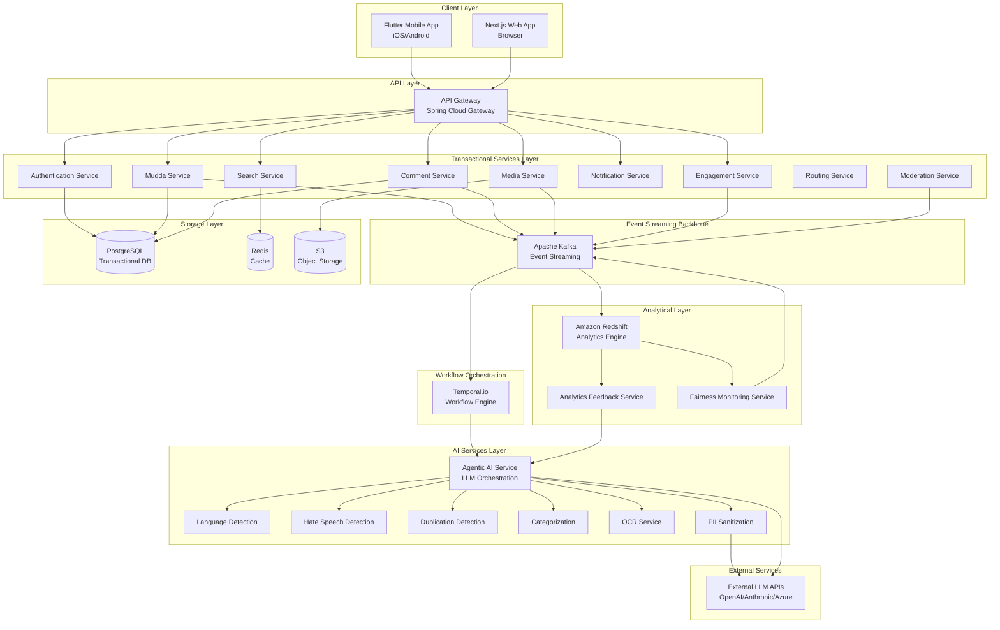
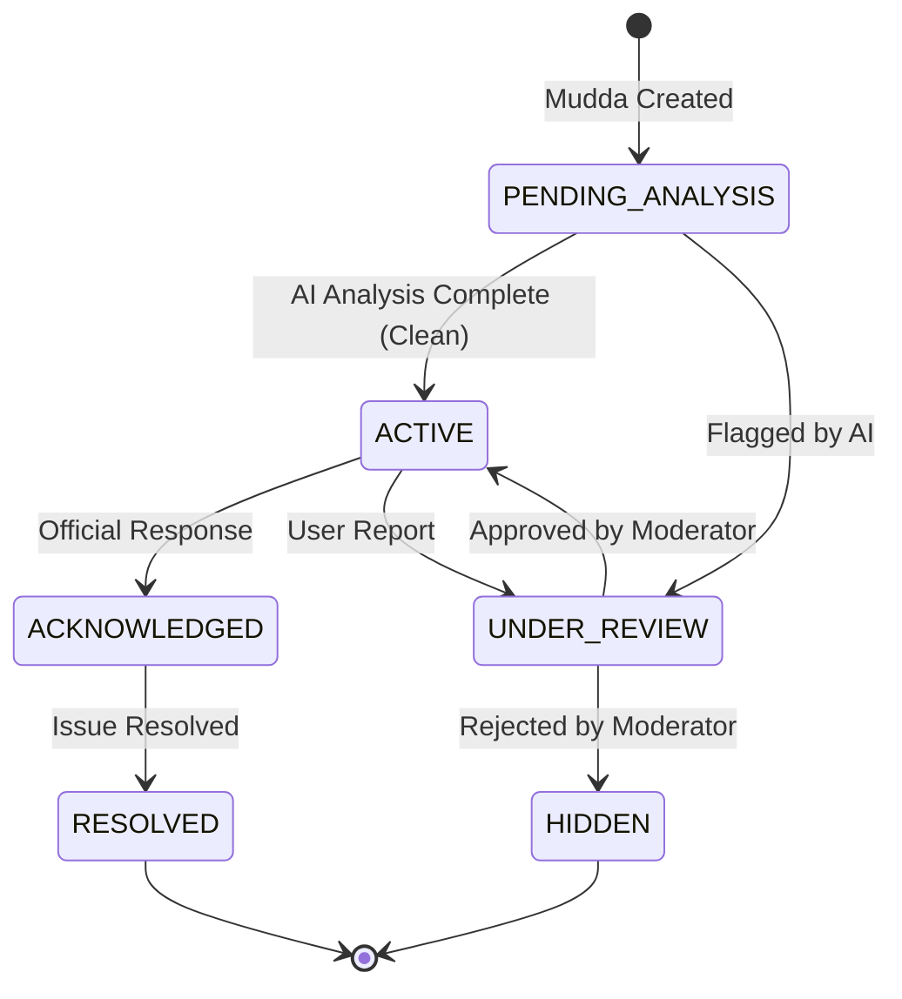

# Design Document: Mudda Civic Social Media Platform

## 1. Overview

### 1.1 System Purpose

The Mudda platform is a large-scale, AI-driven civic engagement system designed to empower Indian citizens to raise, discuss, and track public issues at national scale. The platform combines event-driven microservices architecture with sophisticated AI orchestration to provide intelligent content analysis, moderation, and categorization while maintaining fairness, transparency, and compliance with Indian data protection regulations.

### 1.2 Design Philosophy

The design follows several core principles:

1. **Event-Driven Architecture**: All state changes are represented as immutable events in Kafka, enabling loose coupling, scalability, and audit trails
2. **Separation of Concerns**: Transactional workloads (Spring microservices) are separated from analytical intelligence (Redshift) and workflow orchestration (Temporal.io)
3. **AI-First with Human Oversight**: Agentic AI makes contextual decisions while maintaining human-in-the-loop for low-confidence scenarios
4. **Multilingual by Design**: All AI services support 10+ Indian languages with code-mixed language handling
5. **Responsible AI**: Built-in bias detection, fairness monitoring, explainability, and feedback loops
6. **India-Scale Resilience**: Asynchronous processing, offline support, and graceful degradation for low-bandwidth scenarios
7. **Data Sovereignty**: Configurable data residency with PII sanitization for external AI services

### 1.3 Technology Stack

**Backend Services**: Spring Boot (Java) microservices  
**Event Streaming**: Apache Kafka  
**Workflow Orchestration**: Temporal.io  
**Analytical Engine**: Amazon Redshift  
**Object Storage**: S3-compatible storage (AWS S3, MinIO)  
**Databases**: PostgreSQL (transactional), Redis (caching)  
**API Gateway**: Spring Cloud Gateway  
**Mobile Client**: Flutter (iOS/Android)  
**Web Client**: Next.js (React)  
**AI/ML**: Python-based AI microservices with FastAPI  
**Observability**: Prometheus, Grafana, ELK Stack, Jaeger

### 1.4 Deployment Architecture

The platform is designed for multi-region cloud deployment with emphasis on Indian data centers for data residency compliance. The architecture supports:

- Horizontal scaling of all microservices
- Multi-region deployment with data replication
- Blue-green deployments for zero-downtime updates
- Kubernetes orchestration for container management
- Auto-scaling based on load metrics

## 2. High-Level Architecture

### 2.1 System Context Diagram



### 2.2 Architectural Layers

#### 2.2.1 Client Layer
- **Flutter Mobile App**: Native iOS/Android applications with offline support, local queuing, and image compression
- **Next.js Web App**: Server-side rendered React application with responsive design for desktop and mobile browsers

#### 2.2.2 API Gateway Layer
- **Spring Cloud Gateway**: Single entry point for all client requests
- Responsibilities: Authentication, rate limiting, request routing, load balancing, API versioning
- Rate limits: 100 req/min for reads, 10 req/min for mudda creation

#### 2.2.3 Transactional Services Layer
Spring Boot microservices handling real-time user operations:
- **Authentication Service**: User registration, login, JWT token management, MFA
- **Mudda Service**: Mudda CRUD operations, status management, lifecycle tracking
- **Comment Service**: Comment creation, threading, engagement
- **Media Service**: Image/document upload, storage, CDN serving, thumbnail generation
- **Search Service**: Full-text search, filtering, ranking (Elasticsearch-backed)
- **Notification Service**: Push notifications, email notifications, preference management
- **Engagement Service**: Upvotes, follows, engagement metrics
- **Routing Service**: Jurisdictional routing based on geography
- **Moderation Service**: Human moderation interface, decision recording

#### 2.2.4 Event Streaming Backbone
- **Apache Kafka**: Central nervous system of the platform
- All state changes published as events
- Event sourcing pattern for complete audit trail
- Topics partitioned by mudda_id for ordering guarantees
- At-least-once delivery semantics

#### 2.2.5 Workflow Orchestration Layer
- **Temporal.io**: Durable workflow orchestration
- Manages long-running AI analysis workflows
- Automatic retry with exponential backoff
- Workflow replay for debugging and auditability
- Human-in-the-loop task management
- Exactly-once execution semantics for critical operations

#### 2.2.6 AI Services Layer
Specialized Python microservices (FastAPI) for AI processing:
- **Agentic AI Service**: Central cognitive engine using LLMs for reasoning and tool orchestration
- **Language Detection Service**: Identifies languages including code-mixed variants
- **Hate Speech Detection Service**: Analyzes text/images for abusive content with severity scoring
- **Duplication Detection Service**: Semantic similarity using embeddings
- **Categorization Service**: Multi-label classification across civic domains
- **OCR Service**: Text extraction from images in multiple Indian scripts
- **PII Sanitization Service**: Removes PII before external API calls

#### 2.2.7 Analytical Layer
- **Amazon Redshift**: Data warehouse for aggregated analytics
- **Analytics Feedback Service**: Computes AI performance metrics, triggers threshold adjustments
- **Fairness Monitoring Service**: Bias detection, disparate impact analysis
- Dimensional models optimized for analytical queries
- Separation from transactional workloads

#### 2.2.8 Storage Layer
- **PostgreSQL**: Transactional data for microservices (sharded by region)
- **Redis**: Caching layer for frequently accessed data
- **S3-compatible Object Storage**: Media files with CDN integration

#### 2.2.9 External Services
- **Managed LLM APIs**: OpenAI, Anthropic, Azure OpenAI (with PII sanitization)
- **Self-Hosted Models**: Alternative for data residency compliance

### 2.3 Cross-Cutting Concerns

#### 2.3.1 Security
- TLS 1.3 for all data in transit
- AES-256 encryption for sensitive data at rest
- JWT-based authentication with refresh tokens
- Role-based access control (RBAC)
- API key rotation for service-to-service auth
- Regular security audits and penetration testing

#### 2.3.2 Observability
- Distributed tracing with Jaeger (OpenTelemetry)
- Centralized logging with ELK Stack
- Prometheus metrics with Grafana dashboards
- Health check endpoints on all services
- Alerting for critical errors and performance degradation

#### 2.3.3 Resilience
- Circuit breakers to prevent cascading failures
- Retry logic with exponential backoff
- Graceful degradation when dependencies unavailable
- Automated health checks and service recovery
- Multi-region deployment for disaster recovery

## 3. Detailed Component Design

### 3.1 API Gateway

**Technology**: Spring Cloud Gateway

**Responsibilities**:
- Request authentication and authorization
- Rate limiting per user and endpoint
- Request routing to appropriate microservices
- Load balancing across service instances
- API versioning support
- Request/response logging
- CORS handling

**Key Interfaces**:

```java
// Gateway Configuration
public class GatewayConfig {
    @Bean
    public RouteLocator customRouteLocator(RouteLocatorBuilder builder) {
        return builder.routes()
            .route("mudda-service", r -> r
                .path("/api/v1/muddas/**")
                .filters(f -> f
                    .requestRateLimiter(c -> c
                        .setRateLimiter(redisRateLimiter())
                        .setKeyResolver(userKeyResolver()))
                    .circuitBreaker(c -> c.setName("mudda-cb")))
                .uri("lb://mudda-service"))
            .build();
    }
}

// Rate Limiter Configuration
public class RateLimiterConfig {
    // Standard operations: 100 req/min
    // Mudda creation: 10 req/min
    // Configurable per endpoint
}
```

**Rate Limiting Strategy**:
- Token bucket algorithm using Redis
- Per-user limits based on JWT claims
- Different limits for read vs write operations
- Burst allowance for legitimate traffic spikes
- HTTP 429 responses with Retry-After headers

**Authentication Flow**:
1. Extract JWT from Authorization header
2. Validate token signature and expiration
3. Extract user claims (user_id, roles, permissions)
4. Inject claims into request headers for downstream services
5. Reject invalid/expired tokens with HTTP 401


### 3.2 Authentication Service

**Technology**: Spring Boot with Spring Security

**Responsibilities**:
- User registration and profile management
- Authentication (login, logout, token refresh)
- Multi-factor authentication (MFA)
- Password reset workflows
- JWT token generation and validation
- Session management

**Data Model**:

```java
@Entity
public class User {
    @Id
    private UUID userId;
    private String email;
    private String phoneNumber;
    private String passwordHash; // bcrypt with 12 rounds
    private String preferredLanguage;
    private LocalDateTime createdAt;
    private LocalDateTime lastLoginAt;
    private boolean mfaEnabled;
    private String mfaSecret;
    private UserStatus status; // ACTIVE, SUSPENDED, DELETED
    private Set<Role> roles;
}

@Entity
public class RefreshToken {
    @Id
    private UUID tokenId;
    private UUID userId;
    private String tokenHash;
    private LocalDateTime expiresAt;
    private LocalDateTime createdAt;
}
```

**Key Operations**:

```java
public interface AuthenticationService {
    // Registration
    UserRegistrationResponse register(UserRegistrationRequest request);
    
    // Authentication
    AuthenticationResponse authenticate(LoginRequest request);
    AuthenticationResponse refreshToken(String refreshToken);
    void logout(String accessToken);
    
    // MFA
    MfaSetupResponse setupMfa(UUID userId);
    AuthenticationResponse verifyMfa(UUID userId, String code);
    
    // Password Management
    void initiatePasswordReset(String email);
    void resetPassword(String resetToken, String newPassword);
}
```

**JWT Token Structure**:

```json
{
  "sub": "user-uuid",
  "email": "user@example.com",
  "roles": ["USER", "MODERATOR"],
  "preferred_language": "hi",
  "iat": 1234567890,
  "exp": 1234571490
}
```

**Security Considerations**:
- Password hashing: bcrypt with minimum 12 rounds
- JWT signing: RS256 with key rotation every 90 days
- Access token TTL: 1 hour
- Refresh token TTL: 30 days
- MFA using TOTP (Time-based One-Time Password)
- Account lockout after 5 failed login attempts
- Password complexity requirements enforced

### 3.3 Mudda Service

**Technology**: Spring Boot with JPA/Hibernate

**Responsibilities**:
- Mudda creation, retrieval, update
- Status lifecycle management
- Geographic data validation
- Event emission to Kafka
- Duplicate linking
- Category assignment

**Data Model**:

```java
@Entity
public class Mudda {
    @Id
    private UUID muddaId;
    private UUID authorId;
    private String title;
    private String description; // max 5000 chars
    private MuddaStatus status; // PENDING_ANALYSIS, ACTIVE, UNDER_REVIEW, ACKNOWLEDGED, RESOLVED
    private LocalDateTime createdAt;
    private LocalDateTime updatedAt;
    
    // Geographic data
    private Double latitude;
    private Double longitude;
    private String address;
    private String city;
    private String district;
    private String state;
    private String jurisdiction;
    
    // AI analysis results
    private Set<String> categories;
    private Double hateSpeechScore;
    private Boolean flaggedForReview;
    private String languageCode;
    private Boolean isCodeMixed;
    
    // Engagement metrics
    private Integer upvoteCount;
    private Integer commentCount;
    private Integer viewCount;
    
    // Duplication
    private UUID linkedToMuddaId; // if duplicate
    
    // Media
    @OneToMany(mappedBy = "mudda")
    private List<MediaAttachment> attachments;
}

@Entity
public class MediaAttachment {
    @Id
    private UUID attachmentId;
    @ManyToOne
    private Mudda mudda;
    private String storageKey; // S3 key
    private String contentType;
    private Long fileSize;
    private String ocrText; // extracted text
    private LocalDateTime uploadedAt;
}
```

**Key Operations**:

```java
public interface MuddaService {
    // CRUD operations
    MuddaResponse createMudda(CreateMuddaRequest request, UUID userId);
    MuddaResponse getMudda(UUID muddaId);
    List<MuddaResponse> listMuddas(MuddaFilter filter, Pageable pageable);
    MuddaResponse updateMuddaStatus(UUID muddaId, MuddaStatus newStatus, String reason);
    
    // Category and analysis updates
    void updateCategories(UUID muddaId, Set<String> categories);
    void updateHateSpeechScore(UUID muddaId, Double score);
    void flagForReview(UUID muddaId, String reason);
    
    // Duplication
    void linkDuplicate(UUID muddaId, UUID originalMuddaId);
    List<MuddaResponse> findSimilarMuddas(UUID muddaId);
    
    // Engagement
    void incrementViewCount(UUID muddaId);
}
```

**Event Emission**:

```java
// Kafka event published on mudda creation
public class MuddaCreatedEvent {
    private UUID muddaId;
    private UUID authorId;
    private String title;
    private String description;
    private Double latitude;
    private Double longitude;
    private List<String> mediaKeys;
    private LocalDateTime timestamp;
}

// Kafka event published on status change
public class MuddaStatusChangedEvent {
    private UUID muddaId;
    private MuddaStatus oldStatus;
    private MuddaStatus newStatus;
    private String reason;
    private UUID changedBy;
    private LocalDateTime timestamp;
}
```

**Status Lifecycle**:



### 3.4 Comment Service

**Technology**: Spring Boot with JPA/Hibernate

**Responsibilities**:
- Comment creation and retrieval
- Threaded discussion support
- Comment moderation
- Event emission to Kafka

**Data Model**:

```java
@Entity
public class Comment {
    @Id
    private UUID commentId;
    private UUID muddaId;
    private UUID authorId;
    private UUID parentCommentId; // for threading
    private String content;
    private LocalDateTime createdAt;
    private LocalDateTime updatedAt;
    private CommentStatus status; // ACTIVE, HIDDEN, DELETED
    private Double hateSpeechScore;
    private Boolean flaggedForReview;
    private Integer upvoteCount;
}
```

**Key Operations**:

```java
public interface CommentService {
    CommentResponse createComment(CreateCommentRequest request, UUID userId);
    CommentResponse getComment(UUID commentId);
    List<CommentResponse> listComments(UUID muddaId, Pageable pageable);
    List<CommentResponse> listReplies(UUID parentCommentId, Pageable pageable);
    void hideComment(UUID commentId, String reason);
    void deleteComment(UUID commentId, UUID userId);
}
```

**Threading Strategy**:
- Parent-child relationships stored in database
- Maximum nesting depth: 5 levels
- Replies loaded on-demand for performance
- Sorting: newest first, with option for most upvoted

### 3.5 Media Service

**Technology**: Spring Boot with S3 SDK

**Responsibilities**:
- Media upload and storage
- Image compression and thumbnail generation
- CDN integration
- OCR triggering
- Resumable uploads

**Key Operations**:

```java
public interface MediaService {
    // Upload operations
    MediaUploadResponse initiateUpload(MediaUploadRequest request, UUID userId);
    MediaUploadResponse uploadChunk(UUID uploadId, byte[] chunk, int chunkNumber);
    MediaUploadResponse completeUpload(UUID uploadId);
    
    // Retrieval
    MediaResponse getMedia(UUID attachmentId);
    String getSignedUrl(UUID attachmentId, int expirySeconds);
    
    // Processing
    void generateThumbnails(UUID attachmentId);
    void triggerOcr(UUID attachmentId);
}
```

**Upload Flow**:
1. Client initiates upload → receives upload_id and chunk size
2. Client uploads chunks with resumable protocol
3. Service stores chunks in temporary storage
4. On completion, service assembles chunks and moves to permanent storage
5. Service generates thumbnails (256x256, 512x512, 1024x1024)
6. Service emits media.uploaded event to Kafka
7. OCR workflow triggered for images

**Storage Strategy**:
- Original files stored in S3 with key: `media/{year}/{month}/{mudda_id}/{attachment_id}.{ext}`
- Thumbnails stored with suffix: `_thumb_256`, `_thumb_512`, `_thumb_1024`
- CDN (CloudFront) for serving media with edge caching
- Lifecycle policy: Archive to Glacier after 2 years

**Image Compression**:
- Mobile app compresses to max 500KB before upload
- Server-side compression for web uploads
- JPEG quality: 85% for balance of quality and size
- Progressive JPEG encoding for better perceived performance

### 3.6 Search Service

**Technology**: Spring Boot with Elasticsearch

**Responsibilities**:
- Full-text search across muddas
- Filtering by categories, location, status
- Ranking and relevance scoring
- Autocomplete suggestions
- Search analytics

**Index Schema**:

```json
{
  "mappings": {
    "properties": {
      "mudda_id": { "type": "keyword" },
      "title": { 
        "type": "text",
        "analyzer": "multilingual_analyzer",
        "fields": {
          "keyword": { "type": "keyword" }
        }
      },
      "description": { 
        "type": "text",
        "analyzer": "multilingual_analyzer"
      },
      "categories": { "type": "keyword" },
      "status": { "type": "keyword" },
      "location": { "type": "geo_point" },
      "city": { "type": "keyword" },
      "state": { "type": "keyword" },
      "language_code": { "type": "keyword" },
      "created_at": { "type": "date" },
      "upvote_count": { "type": "integer" },
      "comment_count": { "type": "integer" }
    }
  }
}
```

**Multilingual Analyzer**:
- Custom analyzer supporting Hindi, Tamil, Telugu, Bengali, etc.
- Tokenization with language-specific rules
- Stemming for supported languages
- Stop word removal
- Synonym expansion for common civic terms

**Search Operations**:

```java
public interface SearchService {
    SearchResponse search(SearchRequest request);
    List<String> autocomplete(String prefix, String language);
    SearchResponse searchByLocation(GeoSearchRequest request);
    SearchResponse advancedSearch(AdvancedSearchRequest request);
}

public class SearchRequest {
    private String query;
    private Set<String> categories;
    private Set<MuddaStatus> statuses;
    private String city;
    private String state;
    private SortOrder sortBy; // RELEVANCE, RECENT, POPULAR
    private int page;
    private int size;
}
```

**Ranking Strategy**:
- Default: BM25 relevance scoring
- Boosting factors:
  - Recent muddas (decay function on created_at)
  - High engagement (upvote_count, comment_count)
  - Exact title matches
  - Geographic proximity (if location provided)
- Personalization based on user's followed categories (future enhancement)

**Index Update Strategy**:
- Real-time indexing via Kafka consumer
- Consumes mudda.created, mudda.updated, mudda.status_changed events
- Bulk indexing for performance
- Index refresh interval: 1 second

