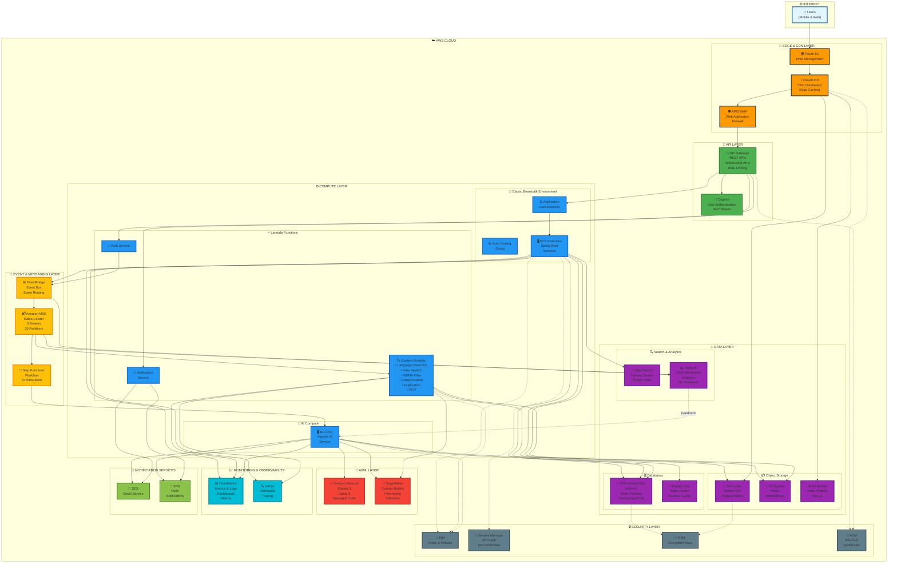
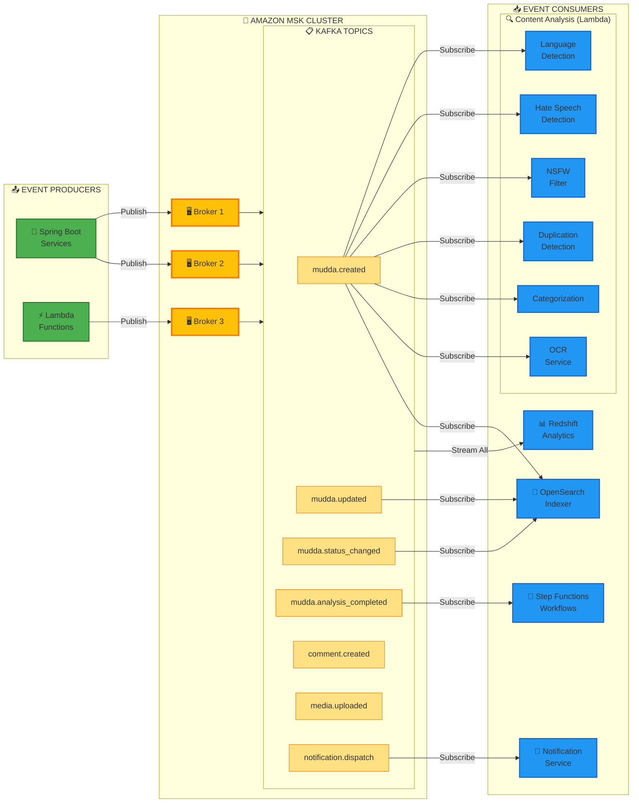
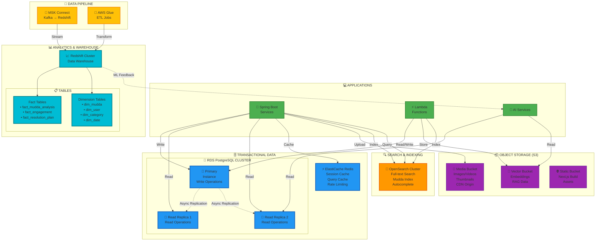
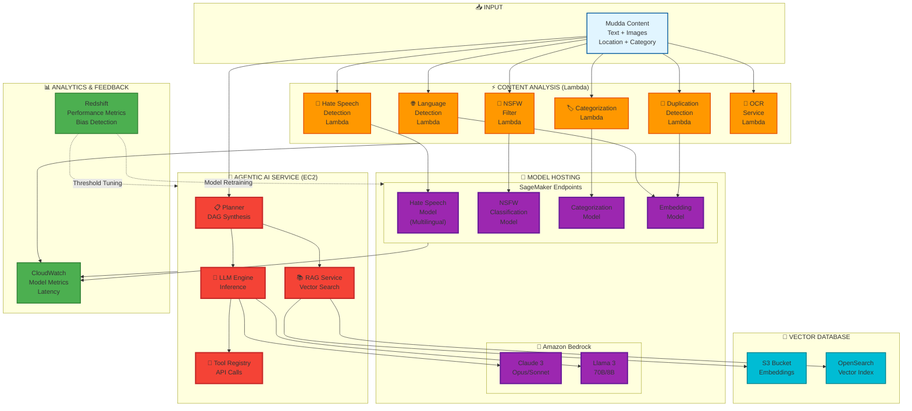
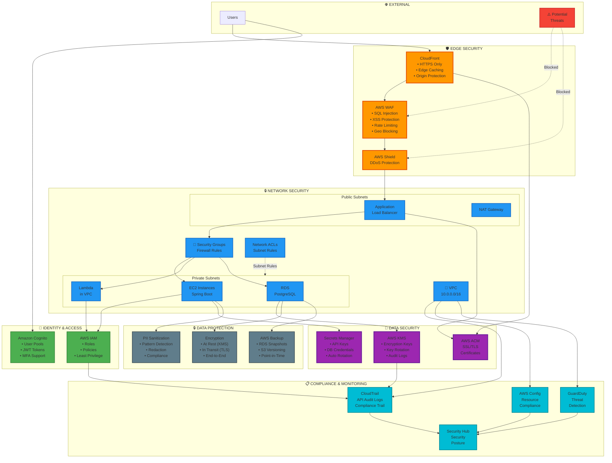
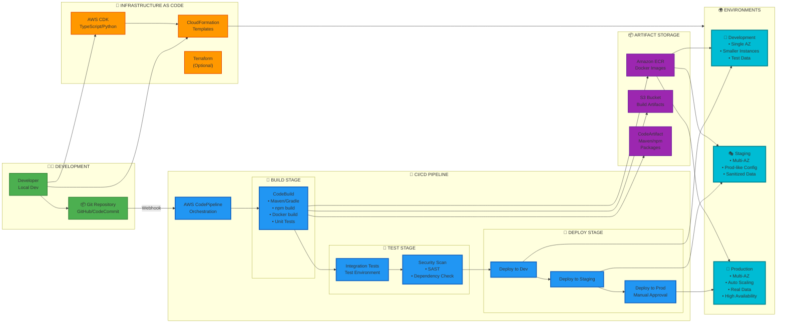

# Mudda Platform - AWS Architecture

**Project:** Mudda Civic Social Media Platform  
**Version:** 1.0  
**Last Updated:** 2026-02-15  
**Purpose:** Detailed AWS Architecture Diagrams

---

## Overview

This document provides comprehensive AWS architecture diagrams for the Mudda platform, showing the complete infrastructure, data flow, and service interactions using AWS services.

---

## 1. Complete AWS Infrastructure Architecture

This diagram shows the complete AWS infrastructure with all services, networking, and data flows.

---

## 2. Event-Driven Architecture Flow

This diagram shows the detailed event flow through Amazon MSK and how different services interact.

---

## 3. Data Architecture & Storage

This diagram shows the data layer architecture with different storage services and their purposes.

---

## 4. AI/ML Services Architecture

This diagram shows the AI and ML services architecture with model hosting and inference.

---

## 5. Security & Compliance Architecture

This diagram shows the security layers and compliance controls.

---

## 6. Deployment & CI/CD Architecture

This diagram shows the deployment pipeline and infrastructure as code setup.

---

## 7. Monitoring & Observability Architecture

This diagram shows the complete monitoring and observability stack.

```mermaid
graph TB
    subgraph Services["⚙️ SERVICES"]
        SpringBoot["Spring Boot<br/>Services"]
        Lambda["Lambda<br/>Functions"]
        AIService["AI Services"]
        RDS["RDS"]
        MSK["MSK"]
    end
    
    subgraph Metrics["📊 METRICS COLLECTION"]
        CloudWatchMetrics["CloudWatch Metrics<br/>• CPU/Memory<br/>• Request Count<br/>• Latency<br/>• Error Rate"]
        CustomMetrics["Custom Metrics<br/>• Business KPIs<br/>• AI Confidence<br/>• User Engagement"]
    end
    
    subgraph Logs["📝 LOGGING"]
        CloudWatchLogs["CloudWatch Logs<br/>• Application Logs<br/>• Access Logs<br/>• Error Logs"]
        LogGroups["Log Groups<br/>• /aws/lambda/*<br/>• /aws/elasticbeanstalk/*<br/>• /aws/rds/*"]
        LogInsights["CloudWatch Logs Insights<br/>Query & Analysis"]
    end
    
    subgraph Tracing["🔍 DISTRIBUTED TRACING"]
        XRay["AWS X-Ray<br/>• Request Tracing<br/>• Service Map<br/>• Latency Analysis<br/>• Error Detection"]
    end
    
    subgraph Dashboards["📈 DASHBOARDS & VISUALIZATION"]
        CWDashboards["CloudWatch Dashboards<br/>• System Health<br/>• AI Performance<br/>• Business Metrics"]
        Grafana["Grafana<br/>(Optional)<br/>Advanced<br/>Visualization"]
    end
    
    subgraph Alerting["🚨 ALERTING & NOTIFICATIONS"]
        CloudWatchAlarms["CloudWatch Alarms<br/>• Threshold Alerts<br/>• Anomaly Detection<br/>• Composite Alarms"]
        SNSAlerts["SNS Topics<br/>• Email<br/>• Slack<br/>• PagerDuty"]
        EventBridge["EventBridge Rules<br/>Automated<br/>Remediation"]
    end
    
    subgraph AIMonitoring["🤖 AI-SPECIFIC MONITORING"]
        ModelMetrics["Model Metrics<br/>• Accuracy<br/>• Latency<br/>• Confidence Scores"]
        BiasDetection["Bias Detection<br/>• Regional Fairness<br/>• Language Parity"]
        DriftDetection["Drift Detection<br/>• Performance Decay<br/>• Distribution Shift"]
    end
    
    %% Services to Metrics
    SpringBoot --> CloudWatchMetrics
    Lambda --> CloudWatchMetrics
    AIService --> CloudWatchMetrics
    RDS --> CloudWatchMetrics
    MSK --> CloudWatchMetrics
    
    SpringBoot --> CustomMetrics
    AIService --> CustomMetrics
    
    %% Services to Logs
    SpringBoot --> CloudWatchLogs
    Lambda --> CloudWatchLogs
    AIService --> CloudWatchLogs
    RDS --> CloudWatchLogs
    CloudWatchLogs --> LogGroups
    LogGroups --> LogInsights
    
    %% Services to Tracing
    SpringBoot --> XRay
    Lambda --> XRay
    AIService --> XRay
    
    %% Metrics to Dashboards
    CloudWatchMetrics --> CWDashboards
    CustomMetrics --> CWDashboards
    CloudWatchMetrics --> Grafana
    XRay --> CWDashboards
    
    %% Alerting Flow
    CloudWatchMetrics --> CloudWatchAlarms
    CloudWatchLogs --> CloudWatchAlarms
    CloudWatchAlarms --> SNSAlerts
    CloudWatchAlarms --> EventBridge
    
    %% AI Monitoring
    AIService --> ModelMetrics
    AIService --> BiasDetection
    AIService --> DriftDetection
    ModelMetrics --> CWDashboards
    BiasDetection --> CloudWatchAlarms
    DriftDetection --> CloudWatchAlarms
    
    %% Styling
    classDef serviceStyle fill:#4caf50,stroke:#2e7d32,stroke-width:2px
    classDef metricsStyle fill:#2196f3,stroke:#1565c0,stroke-width:2px
    classDef logsStyle fill:#ff9800,stroke:#e65100,stroke-width:2px
    classDef traceStyle fill:#9c27b0,stroke:#6a1b9a,stroke-width:2px
    classDef dashStyle fill:#00bcd4,stroke:#00838f,stroke-width:3px
    classDef alertStyle fill:#f44336,stroke:#c62828,stroke-width:3px
    classDef aiMonitorStyle fill:#673ab7,stroke:#4527a0,stroke-width:2px
    
    class SpringBoot,Lambda,AIService,RDS,MSK serviceStyle
    class CloudWatchMetrics,CustomMetrics metricsStyle
    class CloudWatchLogs,LogGroups,LogInsights logsStyle
    class XRay traceStyle
    class CWDashboards,Grafana dashStyle
    class CloudWatchAlarms,SNSAlerts,EventBridge alertStyle
    class ModelMetrics,BiasDetection,DriftDetection aiMonitorStyle
```

---

## Summary

This architecture document provides comprehensive AWS infrastructure diagrams for the Mudda platform covering:

1. **Complete Infrastructure** - All AWS services, networking, and data flows
2. **Event-Driven Architecture** - Amazon MSK cluster with Kafka topics and consumers
3. **Data Architecture** - RDS, S3, OpenSearch, Redshift with data pipelines
4. **AI/ML Services** - Content analysis Lambda functions, SageMaker models, Bedrock LLMs, and Agentic AI
5. **Security & Compliance** - WAF, VPC, encryption, identity management, and monitoring
6. **CI/CD Pipeline** - CodePipeline, build/test/deploy stages, and multi-environment setup
7. **Monitoring & Observability** - CloudWatch metrics/logs, X-Ray tracing, dashboards, and AI-specific monitoring

All diagrams use Mermaid syntax and can be rendered in any Markdown viewer that supports Mermaid diagrams.
