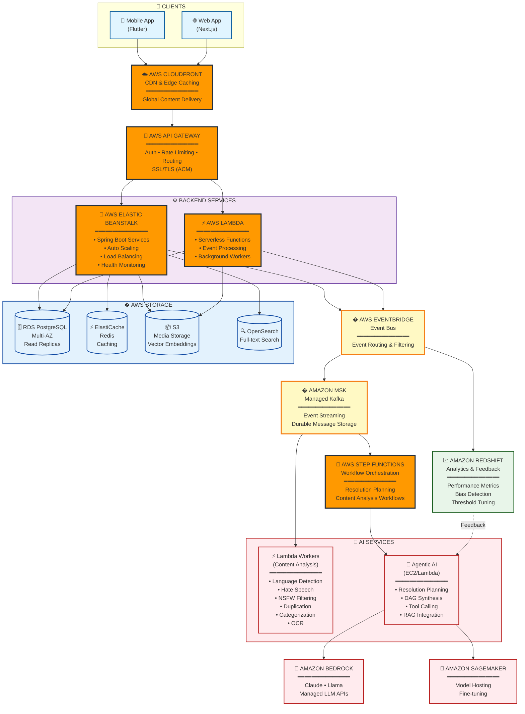
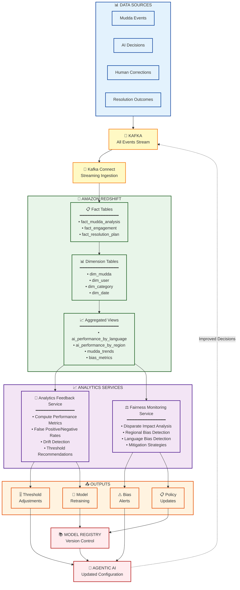
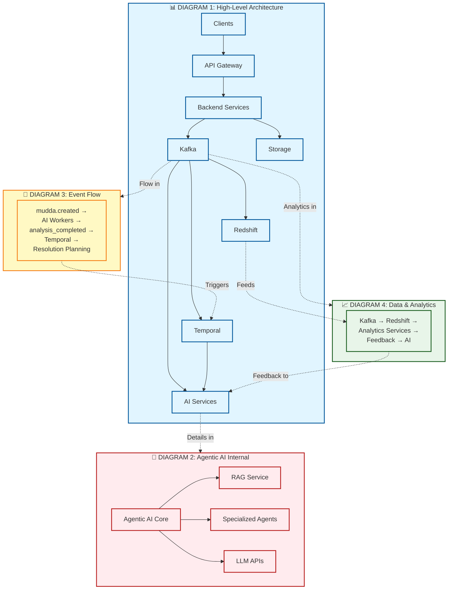

# Design Document: Mudda Civic Social Media Platform

**Project:** Mudda Civic Social Media Platform  
**Version:** 1.0  
**Last Updated:** 2026-02-15  
**Status:** Production-Grade Design

---

## 1. System Overview

### 1.1 System Purpose

The Mudda platform is a large-scale, AI-driven civic engagement system designed to empower Indian citizens to raise, discuss, and track public issues ("muddas") at national scale. The platform combines event-driven microservices architecture with sophisticated AI orchestration to provide intelligent content analysis, categorization, and resolution planning while maintaining fairness, transparency, and compliance with Indian data protection regulations.

The system handles the complete lifecycle of civic issues from creation through resolution, leveraging agentic AI for intelligent workflow planning and execution, background workers for content analysis, and analytical intelligence for continuous improvement.

### 1.2 Architectural Philosophy

The design follows several core architectural principles:

**1. Event-Driven Architecture**  
All state changes are represented as events in Amazon MSK (Managed Streaming for Apache Kafka) and AWS EventBridge, enabling loose coupling, horizontal scalability, and complete audit trails. Services communicate asynchronously through events rather than synchronous calls, allowing the system to handle high throughput and tolerate transient failures.

**2. Separation of Concerns**  
- **Transactional Services** (Spring Boot on AWS Elastic Beanstalk): Handle real-time user operations and data mutations
- **AI Services** (Python FastAPI on AWS Lambda/EC2): Isolated AI processing with specialized models
- **Workflow Orchestration** (AWS Step Functions): Durable, fault-tolerant workflow execution
- **Analytical Intelligence** (Amazon Redshift): Aggregated analytics separated from transactional workloads

**3. AI-First with Human Oversight**  
Agentic AI makes contextual decisions for resolution planning and workflow execution, while specialized AI workers handle content analysis. Low-confidence decisions automatically escalate to human review, maintaining quality and accountability.

**4. Background Worker Pattern for Content Analysis**  
Content analysis (hate speech detection, NSFW filtering, duplication detection, categorization) runs as background workers consuming Kafka events, allowing immediate user feedback while processing occurs asynchronously.

**5. Multilingual by Design**  
All AI services support 10+ Indian languages with code-mixed language handling (Hinglish, Tanglish, etc.). Language detection occurs before processing, and separate confidence thresholds are maintained per language based on empirical performance.

**6. Responsible AI**  
Built-in bias detection, fairness monitoring, explainability, and feedback loops ensure the system treats all users and regions fairly. All AI decisions include reasoning chains and confidence scores for transparency.

**7. India-Scale Resilience**  
Asynchronous processing, offline support, graceful degradation, and low-bandwidth optimization enable reliable operation across diverse connectivity scenarios throughout India.

**8. Data Sovereignty**  
Configurable data residency with PII sanitization for external AI services ensures compliance with Indian data protection regulations. Self-hosted models are preferred for sensitive content processing.

### 1.3 Core Technical Principles

**Scalability**
- Horizontal scaling with AWS Auto Scaling Groups
- Amazon MSK for parallel message processing
- AWS RDS PostgreSQL with Read Replicas
- Auto-scaling based on CloudWatch metrics
- AWS CloudFront CDN for media delivery

**Resilience**
- Circuit breakers to prevent cascading failures
- Retry logic with exponential backoff
- Graceful degradation when dependencies unavailable
- Multi-region deployment for disaster recovery
- Queue buffering for intermittent connectivity

**Observability**
- AWS X-Ray for distributed tracing
- Amazon CloudWatch for centralized logging
- CloudWatch Metrics for real-time monitoring
- CloudWatch Dashboards for AI performance monitoring
- CloudWatch Alarms for critical errors and degradation

**Compliance**
- End-to-end encryption (TLS 1.3)
- PII sanitization before external API calls
- Complete audit trails for all AI decisions
- Data residency enforcement
- Model governance and versioning


### 1.4 Technology Stack

**Frontend**
- Flutter (iOS/Android mobile applications)
- Next.js (React-based web application with SSR)
- AWS CloudFront (CDN for global content delivery)
- AWS S3 (static website hosting)

**Backend Services**
- Spring Boot 3.x (Java 17) for transactional microservices
- FastAPI (Python 3.11+) for AI microservices
- AWS Elastic Beanstalk (application deployment and scaling)
- AWS API Gateway (API management and routing)
- AWS Lambda (serverless functions for event processing)

**Event Streaming & Workflow**
- Amazon MSK (Managed Streaming for Apache Kafka for event streaming)
- AWS EventBridge (event bus for event-driven architecture)
- AWS Step Functions (durable workflow orchestration)

**Compute**
- AWS EC2 (virtual servers for microservices)
- AWS Lambda (serverless compute for background workers)
- AWS Elastic Beanstalk (managed application platform)

**Data Storage**
- AWS RDS PostgreSQL (transactional databases with Multi-AZ)
- AWS ElastiCache Redis (caching layer)
- AWS S3 (object storage for media files)
- AWS S3 with vector embeddings (RAG vector storage)
- Amazon Redshift (analytical data warehouse)
- Amazon OpenSearch Service (full-text search and analytics)

**AI/ML**
- Amazon Bedrock (managed LLM APIs - Claude, Llama)
- Amazon SageMaker (model hosting and fine-tuning)
- LangChain / LlamaIndex for agentic AI orchestration
- Hugging Face Transformers for specialized models
- Sentence Transformers for embeddings

**Security & Compliance**
- AWS ACM (Certificate Manager for SSL/TLS)
- AWS IAM (Identity and Access Management)
- AWS Secrets Manager (credentials management)
- AWS KMS (Key Management Service for encryption)

**Communication**
- AWS SES (Simple Email Service for notifications)
- AWS SNS (Simple Notification Service for push notifications)
- Amazon MSK (Managed Streaming for Apache Kafka)

**Observability**
- Amazon CloudWatch (metrics, logs, and dashboards)
- AWS X-Ray (distributed tracing)
- CloudWatch Logs Insights (log analytics)

**Infrastructure**
- AWS CloudFormation (infrastructure as code)
- AWS CDK (Cloud Development Kit)
- AWS CodePipeline (CI/CD)
- AWS CodeBuild (build automation)
- AWS CloudFront (CDN)

---

## 2. High-Level Architecture

### 2.1 Architecture Diagrams Overview

The system architecture is presented through five focused diagrams, each highlighting a specific aspect of the platform. These diagrams are designed to be investor-friendly, team-friendly, and documentation-friendly, providing clear views of different architectural concerns.

#### Diagram 1: High-Level System Architecture (AWS Stack)

This diagram shows the overall system structure with AWS services.



**Key AWS Services:**
- **CloudFront**: Global CDN for low-latency content delivery
- **API Gateway**: Managed API with authentication and rate limiting
- **Elastic Beanstalk**: Managed platform for Spring Boot services
- **Lambda**: Serverless compute for AI workers and event processing
- **EventBridge**: Event bus for event-driven architecture
- **MSK**: Managed Streaming for Apache Kafka for event streaming
- **Step Functions**: Durable workflow orchestration
- **RDS PostgreSQL**: Managed relational database with Multi-AZ
- **ElastiCache Redis**: In-memory caching
- **S3**: Object storage for media and vector embeddings
- **OpenSearch**: Full-text search and analytics
- **Redshift**: Data warehouse for analytics and feedback loops
- **Bedrock**: Managed LLM APIs (Claude, Llama)
- **SageMaker**: Model hosting and fine-tuning

#### Diagram 2: Agentic AI Internal Design

This diagram details the internal architecture of the Agentic AI System, including external context retrieval, RLHF with government officials, and action plan coordination.

```mermaid
graph TB
    Input["📥 INPUT<br/>━━━━━━━━━━━━━━━<br/>Mudda + Context"]
    
    IssuesAPI["🔍 /issues API<br/>━━━━━━━━━━━━━━━<br/>• Historical Issues<br/>• Similar Cases<br/>• Context Retrieval<br/>• Pattern Analysis"]
    
    subgraph AgenticCore["🎯 AGENTIC AI SERVICE"]
        direction TB
        
        Planner["📋 Planner Module<br/>━━━━━━━━━━━━━━━<br/>• DAG Synthesis<br/>• Multi-step Planning<br/>• Tool Selection<br/>• Action Sequencing"]
        
        LLMEngine["🧠 LLM Inference Engine<br/>━━━━━━━━━━━━━━━<br/>• Model Selection<br/>• Prompt Management<br/>• Chain-of-Thought<br/>• Structured Output<br/>• Plan Generation"]
        
        ToolRegistry["🔧 Tool Registry<br/>━━━━━━━━━━━━━━━<br/>• Available Tools<br/>• Schema Validation<br/>• Tool Execution<br/>• API Integration"]
        
        Evaluator["✅ Decision Evaluator<br/>━━━━━━━━━━━━━━━<br/>• Plan Validation<br/>• Policy Compliance<br/>• Feasibility Check<br/>• Resource Verification"]
        
        ConfidenceScoring["📊 Confidence Scoring<br/>━━━━━━━━━━━━━━━<br/>• Multi-factor Analysis<br/>• Threshold Comparison<br/>• Escalation Logic<br/>• Quality Assessment"]
        
        Memory["💾 Memory Manager<br/>━━━━━━━━━━━━━━━<br/>• Short-term Context<br/>• Long-term History<br/>• Retrieval<br/>• Learning Storage"]
    end
    
    RAG["📚 RAG SERVICE<br/>━━━━━━━━━━━━━━━<br/>• Vector Database<br/>• Regulations<br/>• Historical Cases<br/>• Semantic Search<br/>• Citation Tracking<br/>• Policy Documents"]
    
    PII["🔒 PII Sanitization<br/>━━━━━━━━━━━━━━━<br/>• Pattern Detection<br/>• Redaction<br/>• Compliance<br/>• Data Protection"]
    
    subgraph Agents["🎭 SPECIALIZED AGENTS"]
        direction LR
        Decision["📋 Decision<br/>Planning"]
        Policy["⚖️ Policy &<br/>Compliance"]
        Escalation["🚨 Escalation"]
        Evidence["📑 Evidence"]
        Impact["📊 Impact"]
        Engagement["👥 Engagement"]
        Reflection["🔍 Reflection"]
    end
    
    AILogging["📝 AI Logging<br/>━━━━━━━━━━━━━━━<br/>• Prompt History<br/>• Audit Trail<br/>• Memory Layer<br/>• RLHF Data"]
    
    LLM["🤖 AMAZON BEDROCK<br/>━━━━━━━━━━━━━━━<br/>• Claude 3<br/>• Llama 3<br/>• Managed APIs<br/>• Fine-tuned Models"]
    
    SageMaker["🧪 SAGEMAKER<br/>━━━━━━━━━━━━━━━<br/>• Custom Models<br/>• Model Hosting<br/>• Inference Endpoints"]
    
    subgraph HumanLoop["👥 HUMAN-IN-THE-LOOP (RLHF)"]
        direction TB
        GovOfficial["👔 Government Official<br/>━━━━━━━━━━━━━━━<br/>• Review Plan<br/>• Edit Actions<br/>• Approve/Reject<br/>• Provide Feedback<br/>• RLHF Training"]
        
        StaffWorkers["👷 Staff Workers<br/>━━━━━━━━━━━━━━━<br/>• Execute Tasks<br/>• Report Progress<br/>• Update Status<br/>• Field Operations"]
    end
    
    ActionPlan["📋 ACTION PLAN<br/>━━━━━━━━━━━━━━━<br/>• Task Assignment<br/>• Timeline<br/>• Responsibilities<br/>• Coordination"]
    
    Output["📤 OUTPUT<br/>━━━━━━━━━━━━━━━<br/>Resolution Plan (DAG)"]
    
    %% Primary Flow
    Input --> Planner
    Input --> IssuesAPI
    IssuesAPI --> Planner
    
    Planner --> RAG
    RAG --> LLMEngine
    Planner --> LLMEngine
    
    LLMEngine --> PII
    PII --> LLM
    LLM --> LLMEngine
    LLMEngine --> SageMaker
    SageMaker --> LLMEngine
    
    LLMEngine --> Evaluator
    Evaluator --> ConfidenceScoring
    
    %% High Confidence Path
    ConfidenceScoring -->|"High Confidence<br/>(≥0.8)"| Output
    
    %% Low Confidence Path - RLHF
    ConfidenceScoring -->|"Low Confidence<br/>(<0.8)"| GovOfficial
    GovOfficial -->|"Edit & Approve"| Output
    GovOfficial -->|"Feedback"| AILogging
    AILogging -->|"RLHF Training"| LLM
    
    %% Agent Coordination
    Planner --> Agents
    Agents --> LLMEngine
    
    %% Tool Execution
    LLMEngine --> ToolRegistry
    ToolRegistry --> ExternalServices["🔧 External Services<br/>━━━━━━━━━━━━━━━<br/>Notification<br/>Escalation"]
    
    %% Memory Management
    Planner --> Memory
    Memory --> Planner
    
    %% Logging
    LLMEngine --> AILogging
    
    %% Action Plan Execution
    Output --> ActionPlan
    ActionPlan --> GovOfficial
    ActionPlan --> StaffWorkers
    StaffWorkers -->|"Progress Updates"| ActionPlan
    GovOfficial -->|"Supervision"| StaffWorkers
    
    %% Styling with better spacing
    classDef coreStyle fill:#ffebee,stroke:#b71c1c,stroke-width:3px,stroke-dasharray:0
    classDef supportStyle fill:#fce4ec,stroke:#880e4f,stroke-width:2px
    classDef agentStyle fill:#f3e5f5,stroke:#4a148c,stroke-width:2px
    classDef externalStyle fill:#fafafa,stroke:#424242,stroke-width:2px
    classDef humanStyle fill:#e8f5e9,stroke:#2e7d32,stroke-width:3px
    classDef apiStyle fill:#e3f2fd,stroke:#1565c0,stroke-width:2px
    classDef outputStyle fill:#fff3e0,stroke:#ef6c00,stroke-width:3px
    
    class Planner,LLMEngine,ToolRegistry,Evaluator,ConfidenceScoring,Memory coreStyle
    class RAG,PII,AILogging supportStyle
    class Agents,Decision,Policy,Escalation,Evidence,Impact,Engagement,Reflection agentStyle
    class LLM,SageMaker,ExternalServices externalStyle
    class GovOfficial,StaffWorkers,HumanLoop humanStyle
    class IssuesAPI apiStyle
    class Output,ActionPlan outputStyle
```



**Key Components:**

**Core Modules:**
- **Planner**: Synthesizes resolution plans as DAGs with action sequencing
- **LLM Engine**: Manages model inference with prompt templates and plan generation
- **Tool Registry**: Validates and executes tool calls with API integration
- **Evaluator**: Validates plans for correctness, compliance, and feasibility
- **Confidence Scoring**: Determines if human review needed (threshold: 0.8)
- **Memory Manager**: Maintains context across reasoning steps and stores learning data

**Support Services:**
- **RAG Service**: Retrieves relevant regulations, cases, and policy documents
- **/issues API**: Provides historical issues and similar cases for context
- **PII Sanitization**: Ensures data protection and compliance
- **AI Logging**: Captures prompts, audit trails, and RLHF training data

**Specialized Agents:**
- Domain-specific reasoning modules for decision planning, policy compliance, escalation, evidence structuring, impact measurement, engagement, and reflection

**Human-in-the-Loop (RLHF):**
- **Government Officials**: Review plans, edit actions, approve/reject, provide feedback for RLHF training
- **Staff Workers**: Execute tasks, report progress, update status, handle field operations
- **Action Plan**: Coordinates task assignment, timeline, responsibilities, and supervision

**Flow:**
1. Input + /issues API → Planner → RAG → LLM Engine
2. High Confidence (≥0.8) → Direct Output
3. Low Confidence (<0.8) → Government Official Review → Edit & Approve → Output
4. Government Official Feedback → AI Logging → RLHF Training → LLM Improvement
5. Output → Action Plan → Government Officials + Staff Workers
6. Staff Workers report progress → Government Officials supervise

#### Diagram 3: Event Flow Lifecycle

This diagram shows the complete event flow from mudda creation to resolution planning.

```mermaid
sequenceDiagram
    participant User
    participant Gateway
    participant MuddaService
    participant Kafka
    participant Workers as AI Workers<br/>(Background)
    participant Temporal
    participant AgenticAI
    participant RAG
    participant LLM
    participant Services as External<br/>Services
    
    User->>Gateway: Create Mudda
    Gateway->>MuddaService: POST /muddas
    MuddaService->>MuddaService: Save to DB<br/>(status: PENDING_ANALYSIS)
    MuddaService->>Kafka: Emit mudda.created
    MuddaService->>User: 201 Created
    
    Note over Kafka,Workers: Background Processing (Parallel)
    
    Kafka->>Workers: mudda.created event
    
    par Language Detection
        Workers->>Workers: Detect Language
    and Hate Speech
        Workers->>Workers: Analyze Hate Speech
    and NSFW Filter
        Workers->>Workers: Scan Media
    and Duplication
        Workers->>Workers: Check Duplicates
    and Categorization
        Workers->>Workers: Classify Category
    and OCR
        Workers->>Workers: Extract Text
    end
    
    Workers->>MuddaService: Update Analysis Results
    MuddaService->>Kafka: Emit mudda.analysis_completed
    
    alt Content Clean
        MuddaService->>MuddaService: status = ACTIVE
        Kafka->>Temporal: mudda.analysis_completed
        
        Temporal->>AgenticAI: Initiate Resolution Planning
        AgenticAI->>RAG: Query Regulations & Cases
        RAG-->>AgenticAI: Context Retrieved
        
        AgenticAI->>LLM: Generate Resolution Plan
        LLM-->>AgenticAI: Plan DAG
        
        AgenticAI->>AgenticAI: Validate & Score Confidence
        
        alt High Confidence
            AgenticAI->>Services: Execute Tool Calls<br/>(Notify, Route, Escalate)
            AgenticAI->>Kafka: Emit mudda.resolution_planned
        else Low Confidence
            AgenticAI->>Temporal: Escalate to Human
            Note over Temporal: Workflow Paused
        end
        
    else Content Flagged
        MuddaService->>MuddaService: status = UNDER_REVIEW
        Kafka->>Temporal: Initiate Human Review Workflow
    end
    
    classDef userStyle fill:#e1f5ff,stroke:#01579b
    classDef serviceStyle fill:#f3e5f5,stroke:#4a148c
    classDef kafkaStyle fill:#fff9c4,stroke:#f57f17
    classDef aiStyle fill:#ffebee,stroke:#b71c1c
    
    class User userStyle
    class Gateway,MuddaService,Services serviceStyle
    class Kafka kafkaStyle
    class Workers,AgenticAI,RAG,LLM aiStyle
```

**Flow Steps:**
1. User Creates Mudda → Immediate response
2. Background AI Workers → Parallel content analysis
3. Analysis Complete → Status updated
4. If Clean → Temporal triggers resolution planning
5. Agentic AI → Queries RAG, generates plan via LLM
6. Confidence Check → Auto-execute or escalate to human
7. If Flagged → Human review workflow initiated

#### Diagram 4: Data & Analytics Flow

This diagram shows how data flows through the analytical layer and feeds back to improve AI.



**Analytics Flow:**
1. All Events → Kafka → Redshift (via Kafka Connect)
2. Data Modeling → Fact tables + Dimension tables → Aggregated views
3. Analytics Services → Compute metrics, detect drift/bias
4. Feedback Outputs → Threshold adjustments, alerts, retraining triggers
5. Applied to AI → Agentic AI receives updated configuration
6. Continuous Loop → Improved decisions generate new data

**Key Metrics Tracked:**
- Accuracy, Precision, Recall, F1 Score (per language/region)
- False Positive/Negative Rates
- Confidence Score Distributions
- Human Review Rates
- Disparate Impact Across Segments
- Model Drift Indicators

#### Diagram 5: Complete System Integration

This diagram connects all the previous diagrams to show the complete system.



**Integration Points:**
- Diagram 1 provides the overall system structure
- Diagram 2 details the Agentic AI internals (referenced from D1's AI Services)
- Diagram 3 shows the event flow lifecycle (using Kafka and Temporal from D1)
- Diagram 4 shows analytics and feedback (using Redshift from D1, feeding back to AI)
- All diagrams interconnect to form the complete Mudda platform architecture


### 2.2 Frontend Layer

#### 2.2.1 Flutter Mobile Application

**Responsibilities:**
- Native iOS and Android user interfaces
- Offline-first architecture with local data persistence
- Camera integration for direct photo capture
- Image compression before upload (max 500KB)
- Local queuing of operations during offline periods
- Push notification handling
- Biometric authentication support

**Key Features:**
- Mudda creation with text, images, and location
- Real-time comment threading
- Upvoting and engagement
- Search and discovery
- Notification management
- Profile and settings management

**Offline Strategy:**
- SQLite local database for caching
- Queue mudda creation requests when offline
- Sync automatically when connectivity restored
- Progressive image loading with low-resolution previews
- Cached content for offline viewing (up to 100MB)

**Technology:**
- Flutter 3.x with Dart
- Provider / Riverpod for state management
- Dio for HTTP client with retry logic
- Hive / Drift for local storage
- Firebase Cloud Messaging for push notifications

#### 2.2.2 Next.js Web Application

**Responsibilities:**
- Server-side rendered React application
- Responsive design for desktop and mobile browsers
- SEO optimization for public mudda pages
- Real-time updates via WebSocket
- Progressive Web App (PWA) capabilities

**Key Features:**
- Full platform functionality accessible via browser
- Admin and reviewer dashboards
- Analytics and reporting interfaces
- Bulk content review tools
- Advanced search and filtering

**Technology:**
- Next.js 14+ with React 18+
- TypeScript for type safety
- TailwindCSS for styling
- React Query for server state management
- Socket.io for real-time updates
- NextAuth.js for authentication

### 2.3 API Gateway Layer

**Technology:** Spring Cloud Gateway

**Responsibilities:**
- Single entry point for all client requests
- JWT-based authentication and authorization
- Rate limiting per user and endpoint
- Request routing to appropriate microservices
- Load balancing across service instances
- API versioning support (v1, v2)
- Request/response logging and tracing
- CORS handling
- Circuit breaking for downstream services


**Rate Limiting Strategy:**
- Token bucket algorithm using Redis
- Standard operations: 100 requests/minute per user
- Mudda creation: 10 requests/minute per user
- Search operations: 50 requests/minute per user
- Burst allowance for legitimate traffic spikes
- HTTP 429 responses with Retry-After headers

**Authentication Flow:**
1. Extract JWT from Authorization header
2. Validate token signature and expiration
3. Extract user claims (user_id, roles, permissions)
4. Inject claims into request headers for downstream services
5. Reject invalid/expired tokens with HTTP 401

**Routing Configuration:**
```
/api/v1/auth/**        → Authentication Service
/api/v1/muddas/**      → Mudda Service
/api/v1/comments/**    → Comment Service
/api/v1/media/**       → Media Service
/api/v1/search/**      → Search Service
/api/v1/notifications/** → Notification Service
```

### 2.4 Backend Services

#### 2.4.1 Authentication Service

**Responsibilities:**
- User registration and profile management
- Authentication (login, logout, token refresh)
- Multi-factor authentication (TOTP-based MFA)
- Password reset workflows
- JWT token generation and validation
- Session management

**Data Model:**
- Users (userId, email, phoneNumber, passwordHash, preferredLanguage, mfaEnabled)
- RefreshTokens (tokenId, userId, tokenHash, expiresAt)
- Roles and Permissions (RBAC)

**Security:**
- Password hashing: bcrypt with 12 rounds
- JWT signing: RS256 with key rotation every 90 days
- Access token TTL: 1 hour
- Refresh token TTL: 30 days
- Account lockout after 5 failed login attempts

#### 2.4.2 Mudda Service

**Responsibilities:**
- Mudda CRUD operations
- Status lifecycle management (PENDING_ANALYSIS → UNDER_REVIEW → ACTIVE/HIDDEN → ACKNOWLEDGED → RESOLVED)
- Geographic data validation
- Event emission to Kafka
- Duplicate linking
- Category assignment
- Engagement metrics tracking

**Data Model:**
- Mudda (muddaId, authorId, title, description, status, location, categories, hateSpeechScore, languageCode)
- MediaAttachment (attachmentId, muddaId, storageKey, contentType, ocrText)

**Status Lifecycle:**
```
PENDING_ANALYSIS → UNDER_REVIEW (flagged by AI)
UNDER_REVIEW → ACTIVE (approved by reviewer)
UNDER_REVIEW → HIDDEN (rejected by reviewer)
ACTIVE → ACKNOWLEDGED (response received)
ACKNOWLEDGED → RESOLVED (issue resolved)
```

**Kafka Events Emitted:**
- mudda.created
- mudda.updated
- mudda.status_changed
- mudda.analysis_completed


#### 2.4.3 Comment Service

**Responsibilities:**
- Comment creation and retrieval
- Threaded discussion support (max depth: 5 levels)
- Comment review and filtering
- Event emission to Kafka

**Data Model:**
- Comment (commentId, muddaId, authorId, parentCommentId, content, status, hateSpeechScore)

**Threading Strategy:**
- Parent-child relationships stored in database
- Replies loaded on-demand for performance
- Sorting: newest first, with option for most upvoted

#### 2.4.4 Media Service

**Responsibilities:**
- Media upload and storage
- Image compression and thumbnail generation
- CDN integration
- OCR triggering
- Resumable uploads for large files

**Upload Flow:**
1. Client initiates upload → receives upload_id and chunk size
2. Client uploads chunks with resumable protocol
3. Service stores chunks in temporary storage
4. On completion, assembles chunks and moves to permanent S3 storage
5. Generates thumbnails (256x256, 512x512, 1024x1024)
6. Emits media.uploaded event to Kafka
7. OCR workflow triggered for images

**Storage Strategy:**
- Original files: `s3://media/{year}/{month}/{mudda_id}/{attachment_id}.{ext}`
- Thumbnails: `_thumb_256`, `_thumb_512`, `_thumb_1024` suffixes
- CDN (CloudFront) for serving with edge caching
- Lifecycle policy: Archive to Glacier after 2 years

#### 2.4.5 Search Service

**Technology:** Spring Boot + Elasticsearch

**Responsibilities:**
- Full-text search across muddas
- Filtering by categories, location, status
- Ranking and relevance scoring
- Autocomplete suggestions
- Geographic proximity search

**Index Schema:**
```json
{
  "mudda_id": "keyword",
  "title": "text with multilingual_analyzer",
  "description": "text with multilingual_analyzer",
  "categories": "keyword",
  "status": "keyword",
  "location": "geo_point",
  "city": "keyword",
  "state": "keyword",
  "language_code": "keyword",
  "created_at": "date",
  "upvote_count": "integer",
  "comment_count": "integer"
}
```

**Ranking Strategy:**
- BM25 relevance scoring
- Boosting: recent muddas, high engagement, exact title matches, geographic proximity
- Personalization based on user's followed categories (future)

**Index Update:**
- Real-time indexing via Kafka consumer
- Consumes mudda.created, mudda.updated, mudda.status_changed events
- Bulk indexing for performance
- Index refresh interval: 1 second


#### 2.4.6 Notification Service

**Responsibilities:**
- Push notifications for mobile apps
- Email notifications
- SMS notifications (for critical alerts)
- Notification preference management
- Batching to avoid overwhelming users

**Notification Types:**
- Mudda status updates
- New comments on followed muddas
- Responses from authorities
- Content review decisions
- Duplicate suggestions

**Delivery Channels:**
- Firebase Cloud Messaging (mobile push)
- SendGrid / AWS SES (email)
- Twilio (SMS)

#### 2.4.7 Engagement Service

**Responsibilities:**
- Upvote tracking (prevent duplicate votes)
- Follow/unfollow muddas
- Engagement metrics aggregation
- Trending calculation

**Data Model:**
- Upvote (upvoteId, muddaId, userId, timestamp)
- Follow (followId, muddaId, userId, timestamp)


### 2.5 Event Streaming Backbone (Apache Kafka)

**Architecture:**
- Multi-broker Kafka cluster (minimum 3 brokers for production)
- Zookeeper ensemble for coordination (or KRaft mode in Kafka 3.x+)
- Replication factor: 3 for critical topics
- Partitioning strategy: by mudda_id for ordering guarantees

**Core Topics:**
- `mudda.created` - New mudda submissions
- `mudda.updated` - Mudda content updates
- `mudda.status_changed` - Status transitions
- `mudda.analysis_completed` - Background analysis finished
- `mudda.categorized` - Categorization results
- `mudda.duplicates_found` - Duplicate detection results
- `comment.created` - New comments
- `media.uploaded` - Media upload completion
- `notification.dispatch` - Notification requests
- `analytics.event` - Events for analytical ingestion


**Event Sourcing Pattern:**
All state changes are captured as immutable events, providing:
- Complete audit trail
- Event replay capability
- Temporal queries (state at any point in time)
- Debugging and troubleshooting

**Delivery Guarantees:**
- At-least-once delivery semantics
- Idempotency keys in event payloads
- Consumer offset management
- Dead-letter queues for failed processing

### 2.6 Workflow Orchestration (Temporal.io)

**Architecture:**
- Temporal Server cluster (frontend, history, matching, worker services)
- Durable workflow state persistence
- Automatic retry with exponential backoff
- Workflow versioning for safe deployments
- Workflow replay for debugging

**Core Workflows:**

1. **Resolution Planning Workflow**
   - Triggered when mudda transitions to ACTIVE status
   - Orchestrates Agentic AI for resolution planning
   - Manages human-in-the-loop tasks
   - Handles tool calling to Notification and Escalation services
   - Emits resolution plan DAG

2. **Content Review Workflow**
   - Triggered when content flagged for review
   - Assigns to language-appropriate reviewer
   - Waits for human decision (asynchronous)
   - Applies review decision
   - Emits correction events for feedback loops

3. **Escalation Workflow**
   - Triggered by high-priority or urgent issues
   - Notifies designated administrators
   - Tracks acknowledgment and response
   - Updates mudda status

**Workflow Activities:**
- AI evaluation activity (calls Agentic AI Service)
- Human review activity (creates review task, waits for completion)
- Notification activity (sends notifications)
- Persistence activity (updates database)
- RAG query activity (retrieves context)
- Tool invocation activity (calls external services)

**Retry Policies:**
- Exponential backoff: initial 1s, max 60s
- Maximum attempts: 5 for transient failures
- Timeout handling: 30s for AI calls, 24h for human tasks
- Compensation logic for partial failures

### 2.7 AI Services Layer

**Hosting Architecture:**
- **Content Analysis Services**: AWS Lambda functions for serverless, event-driven processing
- **Agentic AI Service**: AWS EC2 or Lambda (depending on workload) for resolution planning
- **Event Source**: Amazon MSK (Managed Streaming for Apache Kafka)
- **Orchestration**: AWS Step Functions for durable workflows
- **Model Hosting**: Amazon SageMaker for custom models, Amazon Bedrock for managed LLMs

The AI layer is divided into two main subsystems:

1. **Content Analysis Workers** - Background services that consume Kafka events for immediate content analysis
2. **Agentic AI System** - Orchestration layer for resolution planning and workflow execution

#### 2.7.1 Content Analysis Workers (AWS Lambda Functions)

These services run as AWS Lambda functions that consume Kafka events from Amazon MSK, processing mudda creation events asynchronously:

**Deployment:**
- Each service deployed as separate Lambda function
- Triggered by Amazon MSK event source mapping
- Auto-scaling based on Kafka partition lag
- Concurrent execution for parallel processing
- CloudWatch monitoring and logging

**Language Detection Service**
- Identifies primary and secondary languages
- Detects code-mixed content (Hinglish, Tanglish, etc.)
- Returns language codes and confidence scores
- Triggers language-specific processing pipelines


**Hate Speech Detection Service**
- Analyzes text and OCR-extracted image text
- Returns severity score (0-1)
- Language-specific models for Indian languages
- Thresholds: 0.7 (flag for review), 0.9 (auto-hide)
- Confidence threshold: 0.6 (below triggers human review)
- Stores results in Redshift for performance monitoring

**NSFW Media Filtering Service**
- Analyzes images and videos for obscene content
- Computer vision models for content classification
- Returns NSFW score and categories
- Auto-flags content above threshold
- Supports multiple Indian cultural contexts

**Duplication Detection Service**
- Computes semantic embeddings of mudda content
- Similarity search against existing muddas
- Threshold: 0.85 similarity for duplicate detection
- Considers text + OCR-extracted image text
- Emits mudda.duplicates_found event with similar muddas
- Stores embeddings for future comparisons

**Categorization Service**
- Multi-label classification across civic domains
- Supported categories: infrastructure, governance, health, public_safety, environment, education, transportation, housing
- Returns categories with confidence scores
- Validates user-provided categories
- Flags for manual review if confidence < 0.6
- Stores results in Redshift for accuracy monitoring

**OCR Service**
- Extracts text from images in multiple Indian scripts
- Supports Devanagari, Tamil, Telugu, Bengali, etc.
- Returns extracted text with confidence scores
- Feeds extracted text to other AI services
- Handles handwritten and printed text

**Processing Flow:**
```
1. User creates mudda → Mudda Service emits mudda.created event
2. Language Detection consumes event → detects language
3. OCR Service (if images present) → extracts text
4. Hate Speech, NSFW, Duplication, Categorization consume event in parallel
5. Each service updates mudda with results
6. When all complete → Mudda Service emits mudda.analysis_completed
7. If clean → status transitions to ACTIVE
8. If flagged → status transitions to UNDER_REVIEW
9. All results stored in Redshift for analytics
```

#### 2.7.2 Agentic AI System

The Agentic AI System is responsible for intelligent resolution planning and workflow execution. It uses LLM reasoning to synthesize resolution plans as Directed Acyclic Graphs (DAGs) and orchestrates tool calling to execute workflows.

**Core Components:**
- Agentic AI Service (orchestration layer)
- RAG Service (contextual knowledge retrieval)
- PII Sanitization Service (data protection)
- AI Logging Service (memory and auditability)
- Specialized Stateful Agents (domain-specific reasoning)

This system is detailed extensively in Section 3.

### 2.8 Data Storage Layer

#### 2.8.1 Transactional Databases (PostgreSQL)

**Database-per-Service Pattern:**
Each microservice has its own PostgreSQL database for data isolation and independent scaling.

**Databases:**
- auth_db (users, tokens, roles)
- mudda_db (muddas, media_attachments)
- comment_db (comments)
- engagement_db (upvotes, follows)


**Sharding Strategy:**
- Horizontal sharding by geographic region (state-level)
- Shard key: state_code
- Enables data residency compliance
- Reduces cross-region latency

**Indexing Strategy:**
- Primary keys: UUID v4 for global uniqueness
- Foreign keys indexed for join performance
- Composite indexes on frequently queried columns
- GiST indexes for geographic queries
- B-tree indexes for range queries

**Replication:**
- Master-replica setup per shard
- Asynchronous replication for read replicas
- Read queries routed to replicas
- Write queries to master

#### 2.8.2 Caching Layer (Redis)

**Use Cases:**
- Session storage
- Rate limiting counters
- Search result caching
- Frequently accessed mudda data
- Real-time leaderboards

**Cache Strategies:**
- Cache-aside pattern for read-heavy data
- Write-through for critical data
- TTL-based expiration
- LRU eviction policy

**Data Structures:**
- Strings: session tokens, rate limit counters
- Hashes: user profiles, mudda summaries
- Sorted Sets: trending muddas, leaderboards
- Lists: recent activity feeds

#### 2.8.3 Object Storage (S3/MinIO)

**Storage Organization:**
```
media/
  {year}/
    {month}/
      {mudda_id}/
        {attachment_id}.{ext}
        {attachment_id}_thumb_256.jpg
        {attachment_id}_thumb_512.jpg
        {attachment_id}_thumb_1024.jpg
```

**Access Control:**
- Pre-signed URLs for secure access
- Expiration: 1 hour for downloads
- CloudFront CDN for global distribution
- Edge caching for frequently accessed media

**Lifecycle Management:**
- Standard storage for recent media (< 1 year)
- Infrequent Access storage for older media (1-2 years)
- Glacier for archival (> 2 years)

#### 2.8.4 Vector Database (for RAG)

**Technology:** Pinecone / Weaviate / Qdrant

**Purpose:**
- Store embeddings for regulations, rules, policies
- Store embeddings for historical resolution cases
- Enable semantic search for RAG retrieval

**Index Organization:**
- Separate namespaces per civic domain
- Metadata filtering by jurisdiction, date, category
- Hybrid search: vector similarity + keyword matching

**Embedding Model:**
- Sentence Transformers (multilingual models)
- Dimension: 768 or 1024
- Self-hosted for data residency compliance

### 2.9 Analytical Layer (Amazon Redshift)

**Purpose:**
- Separate analytical workloads from transactional systems
- Aggregate data for insights and reporting
- Feed AI performance metrics back to services
- Support bias detection and fairness monitoring

**Data Ingestion:**
- Kafka Connect for streaming ingestion
- Consumes all Kafka events
- Near real-time data availability (< 5 minutes)
- ETL transformations for dimensional modeling


**Schema Design:**

**Fact Tables:**
- fact_mudda_analysis (mudda_id, hate_speech_score, nsfw_score, categories, language, timestamp)
- fact_engagement (event_id, mudda_id, user_id, action_type, timestamp)
- fact_resolution_plan (plan_id, mudda_id, dag_json, execution_status, timestamp)

**Dimension Tables:**
- dim_mudda (mudda_id, title, description, status, location, created_at)
- dim_user (user_id, language, region, registration_date)
- dim_category (category_id, category_name, domain)
- dim_date (date_id, date, day, month, year, quarter)

**Aggregated Views:**
- ai_performance_by_language (language, accuracy, precision, recall, f1_score, false_positive_rate, false_negative_rate)
- ai_performance_by_region (region, accuracy, precision, recall, f1_score)
- mudda_trends (date, category, region, count, avg_resolution_time)
- bias_metrics (segment, decision_rate, disparate_impact)

**Query Performance:**
- Columnar storage for analytical queries
- Distribution keys on frequently joined columns
- Sort keys on timestamp columns
- Materialized views for common aggregations
- Automatic query optimization

---

## 3. Detailed AI System Design

This section provides an in-depth technical design of the Agentic AI System, which is the cognitive core of the platform responsible for intelligent resolution planning and workflow execution.

### 3.1 Agentic AI Service Internal Architecture

The Agentic AI Service is built as a multi-agent orchestration system that uses Large Language Models (LLMs) for reasoning and decision-making. It synthesizes resolution plans as Directed Acyclic Graphs (DAGs) and executes them through tool calling.

**Core Modules:**

```
┌─────────────────────────────────────────────────────────────┐
│                  Agentic AI Service                         │
├─────────────────────────────────────────────────────────────┤
│                                                             │
│  ┌──────────────┐  ┌──────────────┐  ┌──────────────┐    │
│  │   Planner    │  │ Tool Registry│  │ LLM Inference│    │
│  │   Module     │  │              │  │   Engine     │    │
│  └──────────────┘  └──────────────┘  └──────────────┘    │
│         │                  │                  │            │
│         └──────────────────┴──────────────────┘            │
│                          │                                 │
│  ┌──────────────┐  ┌──────────────┐  ┌──────────────┐    │
│  │  Decision    │  │  Confidence  │  │   Human      │    │
│  │  Evaluator   │  │   Scoring    │  │  Escalation  │    │
│  └──────────────┘  └──────────────┘  └──────────────┘    │
│                                                             │
│  ┌──────────────┐  ┌──────────────┐  ┌──────────────┐    │
│  │ Agent        │  │  Memory      │  │   Context    │    │
│  │ Coordinator  │  │  Manager     │  │   Manager    │    │
│  └──────────────┘  └──────────────┘  └──────────────┘    │
│                                                             │
└─────────────────────────────────────────────────────────────┘
```


#### 3.1.1 Planner Module

**Responsibility:** Synthesizes resolution plans as DAGs based on mudda analysis and RAG-retrieved context.

**Process:**
1. Receives mudda data (content, category, location, analysis results)
2. Queries RAG Service for relevant regulations and historical cases
3. Constructs LLM prompt with mudda context + RAG context
4. Invokes LLM with chain-of-thought reasoning
5. Parses LLM response into structured DAG representation
6. Validates DAG for cycles, dependencies, and feasibility
7. Returns resolution plan with confidence score

**DAG Structure:**
```json
{
  "plan_id": "uuid",
  "mudda_id": "uuid",
  "confidence": 0.85,
  "nodes": [
    {
      "node_id": "1",
      "action": "notify_local_authority",
      "tool": "notification_service",
      "parameters": {
        "jurisdiction": "city",
        "template": "infrastructure_issue"
      },
      "dependencies": []
    },
    {
      "node_id": "2",
      "action": "route_to_department",
      "tool": "routing_service",
      "parameters": {
        "department": "public_works"
      },
      "dependencies": ["1"]
    },
    {
      "node_id": "3",
      "action": "escalate_if_no_response",
      "tool": "escalation_service",
      "parameters": {
        "timeout_hours": 48,
        "escalation_level": "district"
      },
      "dependencies": ["2"]
    }
  ],
  "reasoning": "Based on regulation XYZ and similar case ABC...",
  "citations": [
    {"type": "regulation", "id": "reg-123", "title": "..."},
    {"type": "case", "id": "case-456", "title": "..."}
  ]
}
```

#### 3.1.2 Tool Registry

**Responsibility:** Maintains catalog of available tools and their schemas for LLM tool calling.

**Registered Tools:**
- `notification_service.send` - Send notifications to authorities
- `routing_service.determine_jurisdiction` - Determine jurisdictional routing
- `escalation_service.escalate` - Escalate mudda priority
- `moderation_service.request_review` - Request human review
- `engagement_service.boost_visibility` - Increase mudda visibility
- `analytics_service.get_similar_cases` - Retrieve similar historical cases
- `rag_service.query` - Query regulations and policies

**Tool Schema Format:**
```json
{
  "name": "notification_service.send",
  "description": "Send notification to government officials",
  "parameters": {
    "type": "object",
    "properties": {
      "jurisdiction": {
        "type": "string",
        "enum": ["city", "district", "state", "national"]
      },
      "template": {"type": "string"},
      "priority": {"type": "string", "enum": ["low", "medium", "high"]}
    },
    "required": ["jurisdiction", "template"]
  }
}
```

**Tool Invocation:**
- LLM generates tool calls in structured format
- Tool Registry validates parameters against schema
- Executes tool via HTTP/gRPC to target service
- Returns result to LLM for next reasoning step


#### 3.1.3 LLM Inference Engine

**Responsibility:** Manages LLM interactions with prompt templating, model selection, and inference parameter control.

**Supported LLM Providers:**
- OpenAI (GPT-4, GPT-4-turbo)
- Anthropic (Claude 3 Opus, Claude 3 Sonnet)
- Azure OpenAI (GPT-4)
- Self-hosted models (Llama 3 70B, Mistral Large)

**Model Selection Strategy:**
- Data residency mode: Use only self-hosted models
- High-stakes decisions: Use GPT-4 or Claude 3 Opus
- Routine planning: Use GPT-4-turbo or Claude 3 Sonnet
- Cost optimization: Use self-hosted models when possible

**Inference Parameters:**
```json
{
  "temperature": 0.3,        // Low for deterministic reasoning
  "top_p": 0.9,              // Nucleus sampling
  "max_tokens": 2048,        // Sufficient for DAG generation
  "frequency_penalty": 0.0,
  "presence_penalty": 0.0,
  "stop_sequences": ["</plan>"]
}
```

**Prompt Caching:**
- Cache system prompts and tool schemas
- Reduce token usage and latency
- Invalidate cache on prompt version changes

**Fallback Strategy:**
- Primary model failure → fallback to secondary model
- All models unavailable → queue for retry
- Timeout (30s) → retry with exponential backoff

#### 3.1.4 Decision Evaluator

**Responsibility:** Evaluates LLM-generated plans for quality, feasibility, and compliance.

**Evaluation Criteria:**
1. **Structural Validity:** DAG has no cycles, all dependencies satisfied
2. **Tool Availability:** All referenced tools exist and are operational
3. **Parameter Validity:** Tool parameters match schemas
4. **Policy Compliance:** Plan adheres to configured policy rules
5. **Feasibility:** Plan is executable within resource constraints
6. **Completeness:** Plan addresses the mudda's core issue

**Validation Process:**
1. **Structural validation:** Check DAG for cycles
2. **Tool validation:** Verify all tools exist in registry
3. **Parameter validation:** Validate tool parameters against schemas
4. **Policy compliance:** Check plan against policy rules
5. Return validation result with confidence score

**Rejection Handling:**
- Invalid plans rejected with detailed error messages
- LLM prompted to regenerate plan with corrections
- Maximum 3 regeneration attempts
- Escalate to human review if all attempts fail


#### 3.1.5 Confidence Scoring Engine

**Responsibility:** Computes confidence scores for AI decisions to determine if human review is needed.

**Confidence Factors:**
1. **LLM Confidence:** Model's self-reported confidence (via logprobs or explicit scoring)
2. **RAG Relevance:** Similarity scores of retrieved regulations and cases
3. **Plan Complexity:** Number of steps, dependencies, and tools involved
4. **Historical Success:** Success rate of similar plans in the past
5. **Language Confidence:** Language detection confidence for multilingual content
6. **Ambiguity Detection:** Presence of conflicting regulations or unclear requirements

**Confidence Calculation:**
- Weighted average of multiple factors:
  - LLM confidence (30%)
  - RAG relevance (25%)
  - Historical success rate (25%)
  - Language confidence (20%)
- Apply complexity penalty for plans with many steps
- Final score ranges from 0.0 to 1.0

**Confidence Thresholds:**
- **High Confidence (≥ 0.8):** Auto-approve and execute plan
- **Medium Confidence (0.6 - 0.8):** Execute with monitoring, flag for post-review
- **Low Confidence (< 0.6):** Escalate to human review before execution

**Dynamic Threshold Adjustment:**
- Analytics Feedback Service monitors false positive/negative rates
- Adjusts thresholds per language and region based on performance
- Increases threshold if false positive rate > 5%
- Decreases threshold if false negative rate > 10%

#### 3.1.6 Human Escalation Interface

**Responsibility:** Manages escalation to human reviewers when AI confidence is low or policy requires human judgment.

**Escalation Triggers:**
1. Confidence score below threshold
2. Conflicting regulations detected
3. High-stakes decision (e.g., legal implications)
4. User appeal of AI decision
5. Policy-mandated human review

**Escalation Process:**
1. Create human-in-the-loop task in Temporal workflow
2. Assign to appropriate reviewer based on:
   - Language expertise
   - Domain knowledge (category)
   - Jurisdiction familiarity
   - Current workload
3. Provide reviewer with:
   - Mudda content and context
   - AI-generated plan with reasoning
   - RAG-retrieved regulations and cases
   - Confidence scores and uncertainty factors
4. Reviewer options:
   - Approve AI plan
   - Modify AI plan
   - Reject and create new plan
   - Request additional information
5. Capture reviewer decision and reasoning
6. Resume Temporal workflow with human decision
7. Emit correction event for feedback loop

**Reviewer Dashboard:**
- Queue of pending reviews sorted by priority
- Mudda details with AI analysis
- Side-by-side comparison of AI plan vs. historical cases
- Regulation viewer with highlighting
- Decision form with reasoning capture
- Performance metrics (accuracy, review time)


#### 3.1.7 Agent Coordinator

**Responsibility:** Orchestrates specialized stateful agents for domain-specific reasoning and decision-making.

**Specialized Agents:**

1. **Decision Planning Agent**
   - Synthesizes high-level resolution strategies
   - Breaks down complex issues into actionable steps
   - Considers multiple resolution pathways
   - Selects optimal approach based on constraints

2. **Policy & Compliance Agent (RAG-powered)**
   - Queries RAG Service for relevant regulations
   - Interprets legal and policy requirements
   - Ensures compliance with jurisdictional rules
   - Identifies conflicting regulations
   - Provides citations and justifications

3. **Routing Agent**
   - Determines appropriate government departments
   - Maps issues to jurisdictional authorities
   - Handles hierarchical escalation paths
   - Considers organizational structure

4. **Escalation Agent**
   - Assesses urgency and priority
   - Determines escalation triggers
   - Manages escalation timelines
   - Tracks response SLAs

5. **Evidence Structuring Agent**
   - Organizes mudda content and attachments
   - Extracts key facts and evidence
   - Structures information for officials
   - Generates executive summaries

6. **Impact Measurement Agent**
   - Estimates potential impact of issue
   - Considers affected population
   - Assesses severity and urgency
   - Prioritizes based on impact

7. **Community Engagement Agent**
   - Analyzes engagement patterns
   - Suggests strategies to increase participation
   - Identifies influential community members
   - Recommends communication approaches

8. **Reflection Agent**
   - Reviews plan quality and completeness
   - Identifies potential issues or gaps
   - Suggests improvements
   - Validates reasoning consistency

**Agent Interaction Pattern:**
```
1. Decision Planning Agent creates initial strategy
2. Policy & Compliance Agent validates against regulations
3. Routing Agent determines authorities to contact
4. Escalation Agent sets priority and timelines
5. Evidence Structuring Agent prepares information package
6. Impact Measurement Agent assesses severity
7. Community Engagement Agent suggests engagement tactics
8. Reflection Agent reviews and validates complete plan
9. Planner Module synthesizes final DAG
```

**Agent Communication:**
- Agents communicate via structured messages
- Shared context maintained in Context Manager
- Agent outputs stored in Memory Manager
- Coordinator ensures proper sequencing

#### 3.1.8 Memory Manager

**Responsibility:** Maintains conversation history and context across multiple reasoning steps within a workflow.

**Memory Types:**

1. **Short-term Memory (Workflow Context)**
   - Current mudda being processed
   - RAG-retrieved context
   - Agent outputs from current workflow
   - Tool call results
   - Intermediate reasoning steps
   - Stored in Redis with workflow_id key
   - TTL: 24 hours

2. **Long-term Memory (Historical Context)**
   - Past resolution plans for similar muddas
   - Successful strategies and patterns
   - Failed approaches to avoid
   - User feedback and corrections
   - Stored in AI Logging Service database
   - Indexed for retrieval


**Memory Retrieval:**
- Semantic search over historical plans
- Retrieve top-k similar cases
- Include in LLM context for informed decision-making
- Improve consistency and quality over time

**Memory Structure:**
```json
{
  "workflow_id": "uuid",
  "mudda_id": "uuid",
  "timestamp": "2026-02-15T10:30:00Z",
  "context": {
    "mudda_content": "...",
    "category": "infrastructure",
    "location": {"city": "Mumbai", "state": "Maharashtra"},
    "rag_context": [
      {"type": "regulation", "content": "...", "relevance": 0.92},
      {"type": "case", "content": "...", "relevance": 0.87}
    ]
  },
  "agent_outputs": [
    {"agent": "decision_planning", "output": "...", "timestamp": "..."},
    {"agent": "policy_compliance", "output": "...", "timestamp": "..."}
  ],
  "tool_calls": [
    {"tool": "routing_service", "parameters": {...}, "result": {...}}
  ],
  "final_plan": {...},
  "confidence": 0.85
}
```

#### 3.1.9 Context Manager

**Responsibility:** Manages conversation context and ensures relevant information is available to LLM at each reasoning step.

**Context Assembly:**
1. Mudda content and metadata
2. Background analysis results (hate speech, categories, etc.)
3. RAG-retrieved regulations and cases
4. Historical similar cases
5. Agent outputs from previous steps
6. Tool call results
7. Policy rules and constraints

**Context Optimization:**
- Token budget management (stay within LLM context window)
- Prioritize most relevant information
- Summarize lengthy documents
- Remove redundant information
- Compress historical context

**Context Window Management:**
- Prioritize context parts in order of importance:
  1. System prompt (500 tokens)
  2. Mudda content (1000 tokens)
  3. RAG regulations (2000 tokens)
  4. RAG cases (1500 tokens)
  5. Agent outputs (2000 tokens)
  6. Tool schemas (1000 tokens)
- Track remaining tokens in context window (max 8000)
- Truncate or summarize lower-priority parts if needed

### 3.2 LLM Reasoning & Tool Calling

#### 3.2.1 Chain-of-Thought Reasoning

The Agentic AI Service uses chain-of-thought (CoT) prompting to elicit step-by-step reasoning from LLMs. This improves decision quality and provides explainability.

**CoT Prompt Structure:**
```
You are an AI assistant helping to resolve civic issues in India.

Given the following civic issue (mudda):
{mudda_content}

Category: {category}
Location: {city}, {state}

Relevant regulations and policies:
{rag_regulations}

Similar past cases:
{rag_cases}

Your task is to create a resolution plan. Think step-by-step:

1. Analyze the issue: What is the core problem?
2. Identify stakeholders: Who needs to be involved?
3. Check regulations: What policies apply?
4. Learn from history: What worked in similar cases?
5. Plan actions: What steps should be taken?
6. Determine sequence: In what order should actions occur?
7. Assign responsibilities: Who should handle each step?

Provide your reasoning for each step, then generate a resolution plan as a DAG.
```


**LLM Response Format:**
```
Reasoning:
1. Issue Analysis: This is an infrastructure issue related to pothole damage...
2. Stakeholders: Local municipal corporation, public works department...
3. Regulations: Municipal Act Section 45 requires road maintenance...
4. Historical Cases: Similar case #123 was resolved by notifying PWD...
5. Action Plan: 
   - Step 1: Notify local authority
   - Step 2: Route to public works department
   - Step 3: Set 48-hour response deadline
   - Step 4: Escalate to district if no response
6. Sequence: Steps must occur in order due to jurisdictional hierarchy
7. Responsibilities: Municipal corporation (Step 1-2), District office (Step 4)

Resolution Plan:
{
  "nodes": [...],
  "reasoning": "Based on Municipal Act Section 45 and similar case #123...",
  "citations": [...]
}
```

**Benefits of CoT:**
- Improved reasoning quality
- Explainable decisions
- Easier debugging
- Better handling of complex issues
- Reduced hallucination

#### 3.2.2 Tool Invocation Strategy

The Agentic AI Service uses function calling (tool calling) to interact with external services. LLMs generate structured tool calls, which are validated and executed by the Tool Registry.

**Tool Call Flow:**
```
1. LLM generates tool call in JSON format
2. Tool Registry validates tool name and parameters
3. Tool Registry executes HTTP/gRPC call to target service
4. Service returns result
5. Result added to conversation context
6. LLM continues reasoning with result
```

**Tool Call Format:**
```json
{
  "tool": "notification_service.send",
  "parameters": {
    "jurisdiction": "city",
    "template": "infrastructure_issue",
    "priority": "high",
    "recipients": ["municipal_commissioner@city.gov.in"]
  },
  "reasoning": "Notifying local authority as per Municipal Act Section 45"
}
```

**Tool Call Validation:**
- Check tool exists in registry
- Validate parameters against schema
- Check parameter types and constraints
- Verify required parameters present
- Reject invalid calls with error message

**Tool Call Execution:**
1. Validate tool call:
   - Check tool exists in registry
   - Validate parameters against schema
   - Verify required parameters present
2. Execute tool call:
   - Get service URL from registry
   - Send HTTP POST with parameters
   - Set timeout (30 seconds)
   - Return result or error

**Error Handling:**
- Tool unavailable → retry with exponential backoff
- Invalid parameters → prompt LLM to correct
- Timeout → retry or escalate to human
- All retries failed → mark workflow as failed, notify admins

#### 3.2.3 Multi-Step Planning Logic

Complex resolution plans require multiple reasoning steps and tool calls. The Agentic AI Service orchestrates multi-step workflows using a loop:

**Multi-Step Loop:**
1. Initialize context with mudda data
2. Query RAG service for relevant regulations and cases
3. Execute reasoning loop (max 10 steps):
   - Assemble context for LLM
   - Invoke LLM with current context
   - Parse LLM response:
     - If tool call: Execute tool, add result to context, continue
     - If plan: Validate plan, return if valid, otherwise request correction
     - If unexpected: Add error to context, continue
4. If max steps reached without valid plan, escalate to human review

**Step Tracking:**
- Each step logged with timestamp
- Reasoning chain captured for explainability
- Tool calls and results recorded
- Errors and retries tracked
- Total token usage monitored


#### 3.2.4 Structured Output Format

To ensure reliable parsing and execution, the Agentic AI Service enforces structured output formats using JSON schemas and constrained generation.

**JSON Schema for Resolution Plan:**
```json
{
  "$schema": "http://json-schema.org/draft-07/schema#",
  "type": "object",
  "required": ["plan_id", "mudda_id", "confidence", "nodes", "reasoning"],
  "properties": {
    "plan_id": {"type": "string", "format": "uuid"},
    "mudda_id": {"type": "string", "format": "uuid"},
    "confidence": {"type": "number", "minimum": 0, "maximum": 1},
    "nodes": {
      "type": "array",
      "items": {
        "type": "object",
        "required": ["node_id", "action", "tool", "parameters", "dependencies"],
        "properties": {
          "node_id": {"type": "string"},
          "action": {"type": "string"},
          "tool": {"type": "string"},
          "parameters": {"type": "object"},
          "dependencies": {"type": "array", "items": {"type": "string"}}
        }
      }
    },
    "reasoning": {"type": "string"},
    "citations": {
      "type": "array",
      "items": {
        "type": "object",
        "properties": {
          "type": {"type": "string", "enum": ["regulation", "case", "policy"]},
          "id": {"type": "string"},
          "title": {"type": "string"}
        }
      }
    }
  }
}
```

**Constrained Generation:**
- Use JSON mode in OpenAI API
- Use structured output in Anthropic API
- Use grammar-based sampling for self-hosted models
- Validate output against schema
- Retry with corrections if validation fails

**Parsing Strategy:**
1. Extract JSON from LLM response
2. Parse JSON string
3. Determine response type:
   - If contains "nodes": Resolution plan → validate and return
   - If contains "tool": Tool call → validate and return
   - Otherwise: Return error
4. Handle errors:
   - JSON decode error → return "Invalid JSON"
   - Schema validation error → return validation details

### 3.3 Prompt Management & Model Registry

#### 3.3.1 Prompt Template Versioning

All prompts are versioned using semantic versioning (major.minor.patch) and stored in the Model Registry.

**Prompt Template Structure:**
```yaml
prompt_id: resolution_planning_v1.2.0
version: 1.2.0
created_at: 2026-01-15T10:00:00Z
created_by: ai-team@mudda.gov.in
status: active
language: en
model_compatibility:
  - gpt-4
  - gpt-4-turbo
  - claude-3-opus
  - claude-3-sonnet

system_prompt: |
  You are an AI assistant helping to resolve civic issues in India.
  You have access to regulations, policies, and historical cases.
  Your goal is to create actionable resolution plans.

user_prompt_template: |
  Given the following civic issue (mudda):
  Title: {{mudda.title}}
  Description: {{mudda.description}}
  Category: {{mudda.category}}
  Location: {{mudda.location.city}}, {{mudda.location.state}}
  
  Relevant regulations:
  {{#each rag_regulations}}
  - {{this.title}}: {{this.summary}}
  {{/each}}
  
  Similar past cases:
  {{#each rag_cases}}
  - Case {{this.id}}: {{this.summary}} (Success: {{this.success}})
  {{/each}}
  
  Create a resolution plan as a DAG with the following structure:
  {json_schema}

variables:
  - mudda.title
  - mudda.description
  - mudda.category
  - mudda.location.city
  - mudda.location.state
  - rag_regulations
  - rag_cases
  - json_schema

changelog:
  - version: 1.2.0
    date: 2026-01-15
    changes: Added historical cases to context
  - version: 1.1.0
    date: 2025-12-01
    changes: Improved regulation formatting
  - version: 1.0.0
    date: 2025-11-01
    changes: Initial version
```


**Prompt Rendering:**
- Use templating engine (Jinja2 or Handlebars)
- Render template with provided variables
- Return rendered prompt string

**Version Management:**
- Major version: Breaking changes (incompatible with previous)
- Minor version: New features (backward compatible)
- Patch version: Bug fixes and improvements
- Active version used for new workflows
- Old versions retained for replay and debugging

**A/B Testing:**
- Deploy new prompt versions to subset of traffic (e.g., 10%)
- Compare performance metrics (confidence, success rate, human review rate)
- Gradually increase traffic if metrics improve
- Rollback if metrics degrade

#### 3.3.2 Model Registry Architecture

The Model Registry is a centralized service that tracks all AI models, their versions, configurations, and deployment metadata.

**Registry Schema:**

**Models Table:**
- model_id, model_name, model_type (llm, embedding, classification)
- provider (openai, anthropic, self-hosted)
- version, deployment_date, status (active, deprecated, retired)
- configuration (JSONB), performance_metrics (JSONB)

**Prompt Templates Table:**
- prompt_id, prompt_name, version, language
- model_compatibility, system_prompt, user_prompt_template
- variables (JSONB), status, created_at, created_by

**Model Deployments Table:**
- deployment_id, model_id, prompt_id
- environment (production, staging, canary)
- traffic_percentage, deployed_at, deployed_by

**Inference Logs Table:**
- log_id, model_id, prompt_id, mudda_id
- input_tokens, output_tokens, latency_ms
- confidence_score, timestamp
    model_id UUID REFERENCES models(model_id),
    prompt_id UUID REFERENCES prompt_templates(prompt_id),
    mudda_id UUID,
    input_tokens INTEGER,
    output_tokens INTEGER,
    latency_ms INTEGER,
    confidence FLOAT,
    success BOOLEAN,
**Model Configuration Example:**
```json
{
  "model_id": "uuid",
  "model_name": "gpt-4-turbo",
  "model_type": "llm",
  "provider": "openai",
  "version": "gpt-4-turbo-2024-04-09",
  "configuration": {
    "temperature": 0.3,
    "top_p": 0.9,
    "max_tokens": 2048
  },
  "performance_metrics": {
    "avg_latency_ms": 1500,
    "avg_confidence": 0.82,
    "success_rate": 0.94
  }
}
```


#### 3.3.3 Inference Parameters

Inference parameters control LLM behavior and are tuned for different use cases.

**Parameter Profiles:**

**Deterministic Reasoning (Resolution Planning):**
```json
{
  "temperature": 0.3,
  "top_p": 0.9,
  "max_tokens": 2048,
  "frequency_penalty": 0.0,
  "presence_penalty": 0.0
}
```
- Low temperature for consistent, deterministic outputs
- High top_p for quality while maintaining diversity
- Sufficient tokens for complex DAGs

**Creative Generation (Community Engagement):**
```json
{
  "temperature": 0.7,
  "top_p": 0.95,
  "max_tokens": 1024,
  "frequency_penalty": 0.3,
  "presence_penalty": 0.3
}
```
- Higher temperature for creative suggestions
- Penalties to avoid repetition

**Concise Summarization (Evidence Structuring):**
```json
{
  "temperature": 0.2,
  "top_p": 0.85,
  "max_tokens": 512,
  "frequency_penalty": 0.0,
  "presence_penalty": 0.0
}
```
- Very low temperature for factual accuracy
- Limited tokens for conciseness

**Parameter Tuning:**
- A/B test different parameter combinations
- Monitor quality metrics (confidence, success rate)
- Adjust based on feedback from Analytics Service
- Document optimal parameters per use case

#### 3.3.4 Canary Model Rollout Strategy

New models and prompts are deployed using canary releases to minimize risk.

**Canary Deployment Process:**

**Phase 1: Canary (10% traffic)**
- Deploy new model/prompt to 10% of traffic
- Monitor for 48 hours
- Compare metrics with baseline:
  - Confidence scores
  - Success rate
  - Human review rate
  - Latency
  - Error rate
- Decision: Proceed or rollback

**Phase 2: Expanded Canary (25% traffic)**
- Increase to 25% if Phase 1 successful
- Monitor for 48 hours
- Continue metric comparison
- Decision: Proceed or rollback

**Phase 3: Majority (50% traffic)**
- Increase to 50% if Phase 2 successful
- Monitor for 24 hours
- Decision: Proceed or rollback

**Phase 4: Full Rollout (100% traffic)**
- Deploy to all traffic if Phase 3 successful
- Continue monitoring
- Keep previous version for quick rollback

**Rollback Triggers:**
- Success rate drops > 5%
- Human review rate increases > 10%
- Error rate increases > 2%
- Latency increases > 50%
- Manual rollback by AI team

**Implementation:**
- Hash mudda_id for consistent routing (modulo 100)
- Get active deployments from registry
- Route based on cumulative traffic percentage
- Fallback to default model if no match

### 3.4 Confidence Thresholds & Risk Scoring

#### 3.4.1 Confidence Computation

Confidence scores are computed using a multi-factor approach that considers various aspects of the AI decision.

**Confidence Formula:**
```
confidence = w1 * llm_confidence 
           + w2 * rag_relevance 
           + w3 * historical_success 
           + w4 * language_confidence
           - complexity_penalty
           - ambiguity_penalty

where:
  w1 = 0.30 (LLM self-assessment weight)
  w2 = 0.25 (RAG retrieval quality weight)
  w3 = 0.25 (Historical performance weight)
  w4 = 0.20 (Language detection weight)
```

**Component Calculations:**

**1. LLM Confidence:**
- Extract from logprobs (OpenAI) or explicit scoring (Anthropic)
- Average probability of top tokens in response
- Normalize to 0-1 range

**2. RAG Relevance:**
- Average similarity score of top-k retrieved documents
- Weight by document type (regulations > cases > policies)
- Penalize if no highly relevant documents found (< 0.7 similarity)

**3. Historical Success:**
- Query similar past plans from Memory Manager
- Calculate success rate of similar plans
- Weight by recency (recent cases weighted higher)

**4. Language Confidence:**
- Language detection confidence score
- Penalize for code-mixed languages (multiply by 0.9)
- Penalize for low-resource languages (multiply by 0.85)

**5. Complexity Penalty:**
```
complexity_penalty = min(0.1 * (num_nodes - 3), 0.3)
```
- More complex plans (more nodes) have lower confidence
- Cap penalty at 0.3

**6. Ambiguity Penalty:**
```
ambiguity_penalty = 0.2 if conflicting_regulations_found else 0.0
```
- Penalize if conflicting regulations detected
- Requires human judgment


#### 3.4.2 Threshold Tiers

Confidence thresholds determine whether AI decisions are auto-approved, require review, or are auto-rejected.

**Threshold Configuration:**

**Tier 1: Auto-Approve (confidence ≥ 0.8)**
- High confidence in AI decision
- Execute plan automatically
- Log for post-review audit
- Monitor outcomes for feedback

**Tier 2: Human Review (0.6 ≤ confidence < 0.8)**
- Medium confidence
- Create human-in-the-loop task
- Provide AI plan as suggestion
- Require human approval before execution
- Capture human reasoning for feedback

**Tier 3: Auto-Reject (confidence < 0.6)**
- Low confidence in AI decision
- Do not execute automatically
- Escalate to human for manual planning
- Provide AI analysis as context only
- Flag for AI team review (potential model issue)

**Language-Specific Thresholds:**

Different languages have different model performance, requiring adjusted thresholds:

- English, Hindi: auto_approve=0.80, review=0.60
- Tamil, Telugu, Bengali, Marathi: auto_approve=0.75, review=0.55
- Code-mixed: auto_approve=0.70, review=0.50

**Region-Specific Thresholds:**

Adjust thresholds based on regional performance:

- Maharashtra, Karnataka: Baseline (0.0 adjustment)
- Tamil Nadu: -0.05 (lower threshold, higher auto-approve rate)
- Uttar Pradesh: +0.05 (higher threshold, more human review)

#### 3.4.3 Dynamic Threshold Adjustment

The Analytics Feedback Service continuously monitors AI performance and adjusts thresholds to maintain target false positive and false negative rates.

**Target Metrics:**
- False Positive Rate: < 5%
- False Negative Rate: < 10%
- Human Review Rate: 15-25% (balance automation and quality)

**Adjustment Algorithm:**
1. Get current thresholds for language and region
2. Calculate adjustments based on metrics:
   - If false positive rate > 5%: increase auto-approve threshold by 0.02
   - If false negative rate > 10%: decrease review threshold by 0.02
   - If human review rate > 25%: decrease auto-approve threshold by 0.01
   - If human review rate < 15%: increase auto-approve threshold by 0.01
3. Apply adjustments with bounds:
   - auto_approve: min=0.70, max=0.90
   - review: min=0.50, max=0.70
4. Return threshold update with reasoning

**Adjustment Frequency:**
- Weekly analysis of performance metrics
- Gradual adjustments (max ±0.02 per week)
- Require minimum sample size (100 decisions)
- Log all threshold changes with justification
- Alert AI team for significant changes

### 3.5 Human-in-the-Loop Design

#### 3.5.1 Escalation Triggers

Human review is triggered by multiple conditions to ensure quality and compliance.

**Automatic Escalation Triggers:**

1. **Low Confidence (confidence < 0.6)**
   - AI not confident in decision
   - Requires human judgment

2. **Conflicting Regulations**
   - Multiple applicable regulations with contradictions
   - Requires legal interpretation

3. **High-Stakes Decision**
   - Potential legal implications
   - Large affected population (> 10,000 people)
   - High financial impact (> ₹10 lakhs)

4. **Novel Issue Type**
   - No similar historical cases found
   - New category or jurisdiction combination

5. **User Appeal**
   - User contests AI decision
   - Requires human reconsideration

6. **Policy-Mandated Review**
   - Certain categories always require human review
   - Regulatory compliance requirement

7. **Language Uncertainty**
   - Language detection confidence < 0.7
   - Code-mixed language with complex interpretation

8. **Bias Alert**
   - Fairness Monitoring Service flags potential bias
   - Requires human verification


#### 3.5.2 Content Review UI Integration

The platform provides a web-based interface for human reviewers to evaluate AI decisions and provide corrections.

**Dashboard Features:**

**1. Review Queue**
- List of pending reviews sorted by priority
- Filters: language, category, region, urgency
- Estimated review time per item
- Reviewer assignment status

**2. Mudda Detail View**
- Full mudda content with media
- Background analysis results (hate speech, categories, etc.)
- User profile and history
- Engagement metrics (upvotes, comments)

**3. AI Analysis Panel**
- AI-generated resolution plan (DAG visualization)
- Confidence scores and breakdown
- Reasoning chain from LLM
- RAG-retrieved regulations and cases
- Citations and references

**4. Historical Context**
- Similar past muddas and their resolutions
- Success/failure patterns
- Regional trends

**5. Decision Interface**
- Approve AI plan (with optional modifications)
- Reject AI plan and create new plan
- Request additional information
- Escalate to senior reviewer
- Reasoning text area (required)
- Confidence in human decision (self-assessment)

**6. Regulation Viewer**
- Full text of relevant regulations
- Highlighting of applicable sections
- Cross-references and precedents

**7. Performance Metrics**
- Reviewer accuracy (agreement with outcomes)
- Average review time
- Decisions per day
- Correction rate (AI vs. human)

**UI Mockup (Conceptual):**
```
┌─────────────────────────────────────────────────────────────┐
│ Mudda Review Dashboard                    [Reviewer: Name]  │
├─────────────────────────────────────────────────────────────┤
│                                                             │
│ ┌─────────────────┐  ┌─────────────────────────────────┐  │
│ │ Review Queue    │  │ Mudda #12345                    │  │
│ │                 │  │ Category: Infrastructure        │  │
│ │ [High Priority] │  │ Location: Mumbai, Maharashtra   │  │
│ │ Mudda #12345    │  │ Language: Hinglish              │  │
│ │ Infrastructure  │  │                                 │  │
│ │                 │  │ Description:                    │  │
│ │ [Medium]        │  │ "Road me bahut bade potholes    │  │
│ │ Mudda #12346    │  │  hain, accidents ho rahe hain"  │  │
│ │ Health          │  │                                 │  │
│ │                 │  │ [View Images] [View Location]   │  │
│ │ [Low]           │  │                                 │  │
│ │ Mudda #12347    │  ├─────────────────────────────────┤  │
│ │ Education       │  │ AI Analysis (Confidence: 0.72)  │  │
│ │                 │  │                                 │  │
│ └─────────────────┘  │ Resolution Plan:                │  │
│                      │ 1. Notify Municipal Corp        │  │
│                      │ 2. Route to Public Works Dept   │  │
│                      │ 3. Set 48h response deadline    │  │
│                      │ 4. Escalate to District if no   │  │
│                      │    response                     │  │
│                      │                                 │  │
│                      │ Reasoning:                      │  │
│                      │ Based on Municipal Act Sec 45   │  │
│                      │ and similar case #789...        │  │
│                      │                                 │  │
│                      │ [View Regulations] [View Cases] │  │
│                      │                                 │  │
│                      ├─────────────────────────────────┤  │
│                      │ Your Decision:                  │  │
│                      │ ○ Approve AI Plan               │  │
│                      │ ○ Modify AI Plan                │  │
│                      │ ○ Reject and Create New Plan    │  │
│                      │ ○ Request More Information      │  │
│                      │                                 │  │
│                      │ Reasoning (required):           │  │
│                      │ [Text area]                     │  │
│                      │                                 │  │
│                      │ [Submit Decision]               │  │
│                      └─────────────────────────────────┘  │
└─────────────────────────────────────────────────────────────┘
```

#### 3.5.3 Feedback Capture Mechanism

All human decisions are captured with detailed reasoning to enable feedback loops and continuous improvement.

**Feedback Data Structure:**
```json
{
  "feedback_id": "uuid",
  "mudda_id": "uuid",
  "reviewer_id": "uuid",
  "timestamp": "2026-02-15T14:30:00Z",
  "ai_decision": {
    "plan": {...},
    "confidence": 0.72,
    "reasoning": "..."
  },
  "human_decision": {
    "action": "modify",
    "modified_plan": {...},
    "reasoning": "AI plan was mostly correct but missed escalation to state level for high-impact issue",
    "confidence": 0.9
  },
  "agreement": false,
  "correction_type": "plan_modification",
  "correction_details": {
    "added_nodes": ["escalate_to_state"],
    "removed_nodes": [],
    "modified_parameters": {}
  },
  "review_time_seconds": 180,
  "language": "hi-en",
  "category": "infrastructure",
  "region": "maharashtra"
}
```

**Feedback Processing:**
1. Emit feedback event to Kafka (moderation.override topic)
2. Analytics Feedback Service consumes event
3. Aggregate corrections by type, language, region
4. Identify patterns in AI errors
5. Adjust confidence thresholds
6. Flag for prompt/model improvements
7. Feed to model retraining pipelines

**Correction Categories:**
- **False Positive:** AI flagged incorrectly
- **False Negative:** AI missed violation
- **Plan Incomplete:** Missing steps
- **Plan Incorrect:** Wrong approach
- **Parameter Error:** Wrong tool parameters
- **Regulation Misinterpretation:** Incorrect legal interpretation
- **Priority Misjudgment:** Wrong urgency assessment

### 3.6 AI Feedback & Continuous Learning Loop

The platform implements a comprehensive feedback loop that uses analytical insights and human corrections to continuously improve AI performance.

#### 3.6.1 Analytics Integration via Redshift

All AI decisions, human corrections, and outcomes are ingested into Redshift for analysis.

**Data Flow:**
```
1. AI makes decision → logged to AI Logging Service
2. Human reviews → correction logged to Review Service
3. Outcome tracked → resolution success/failure logged
4. All events → Kafka → Redshift (via Kafka Connect)
5. Analytics Feedback Service queries Redshift
6. Insights fed back to Agentic AI Service
```

**Key Analytical Queries:**

**1. False Positive Rate by Language:**
- Count false positives (human approved, AI rejected) per language
- Calculate rate over last 7 days
- Group by language

**2. False Negative Rate by Region:**
- Count false negatives (human rejected, AI approved) per region
- Calculate rate over last 7 days
- Group by region

**3. Plan Success Rate by Category:**
- Count successful resolutions per category
- Calculate success rate and average resolution time
- Analyze last 30 days

**4. Correction Patterns:**
- Count correction types and frequency
- Calculate average AI confidence for each correction type
- Identify affected categories 
    correction_type,
    COUNT(*) AS frequency,
    AVG(ai_confidence) AS avg_ai_confidence,
    ARRAY_AGG(DISTINCT category) AS affected_categories
FROM human_corrections
WHERE timestamp >= NOW() - INTERVAL '7 days'
GROUP BY correction_type
ORDER BY frequency DESC;


#### 3.6.2 Drift Detection

Model drift occurs when AI performance degrades over time due to changing data distributions or evolving user behavior.

**Drift Monitoring:**

**1. Performance Drift:**
- Track accuracy, precision, recall over time
- Alert if metrics drop > 5% from baseline
- Compare current week vs. previous 4 weeks

**2. Confidence Drift:**
- Monitor average confidence scores
- Alert if confidence drops significantly
- May indicate model uncertainty increasing

**3. Distribution Drift:**
- Track mudda category distribution
- Alert if new categories emerge
- May require model retraining

**4. Language Drift:**
- Monitor language usage patterns
- Track code-mixed language evolution
- Alert if new language combinations appear

**Drift Detection Algorithm:**
1. Compare current metrics vs. baseline (previous 4 weeks)
2. Check accuracy drift: Alert if change > 5%
3. Check confidence drift: Alert if average confidence drops > 5%
4. Check distribution drift: Calculate KL divergence, alert if > 0.1
5. If drift detected:
   - Severity: high (accuracy change > 10%), medium (otherwise)
   - Recommendation: Model retraining or prompt adjustment

**Drift Response:**
- Alert AI team immediately
- Increase human review rate temporarily
- Investigate root cause
- Retrain model or adjust prompts
- Deploy fix via canary rollout

#### 3.6.3 Bias Detection

The Fairness Monitoring Service continuously analyzes AI decisions for bias across demographic and geographic segments.

**Bias Metrics:**

**1. Disparate Impact:**
```
disparate_impact = (decision_rate_group_A / decision_rate_group_B)
```
- Measures difference in decision rates between groups
- Alert if ratio < 0.8 or > 1.25 (20% threshold)

**2. Equal Opportunity:**
- Measures false negative rates across groups
- Ensures all groups have equal chance of positive outcome

**3. Predictive Parity:**
- Measures precision across groups
- Ensures positive predictions equally accurate

**Bias Detection Query:**
- Calculate approval rates by region over last 7 days
- Compare approval rates across all region pairs
- Flag disparate impact where ratio < 0.8 or > 1.25

**Bias Mitigation Strategies:**

1. **Threshold Adjustment:**
   - Lower threshold for underserved regions
   - Increase auto-approve rate

2. **Data Augmentation:**
   - Collect more training data from underrepresented regions
   - Balance training dataset

3. **Model Replacement:**
   - Use region-specific models
   - Fine-tune on regional data

4. **Manual Review:**
   - Increase human review for affected segments
   - Ensure fair treatment

5. **Policy Updates:**
   - Adjust escalation rules
   - Prioritize underserved regions

#### 3.6.4 Model Retraining Workflow

Specialized AI models (hate speech, categorization, etc.) are periodically retrained using feedback data.

**Retraining Triggers:**
- Scheduled: Monthly retraining cycle
- Performance degradation: Accuracy drops > 5%
- Drift detected: Distribution shift identified
- New data available: Significant new labeled data
- Bias detected: Fairness issues identified

**Retraining Process:**

**1. Data Collection:**
- Query Redshift for labeled data between date range
- Select: mudda_content, ai_prediction, human_label, language, region, category
- Filter: Only records with human labels
- Balance dataset by class, language, and region

**2. Model Training:**
- Split data: 80% train, 10% validation, 10% test
- Train new model version
- Evaluate on test set
- Compare with current production model

**3. Model Validation:**
- Accuracy, precision, recall, F1 score
- Per-language performance
- Per-region performance
- Bias metrics (disparate impact)
- Latency benchmarks

**4. Model Deployment:**
- Register in Model Registry
- Deploy to staging environment
- Run A/B test (10% traffic)
- Monitor for 48 hours
- Gradual rollout if successful
- Rollback if performance degrades

**5. Documentation:**
- Training data statistics
- Model architecture and hyperparameters
- Performance metrics
- Known limitations
- Deployment date and version

#### 3.6.5 Policy Updates

Configurable policy rules guide AI decision-making and are updated based on analytical insights.

**Policy Types:**

**1. Confidence Thresholds:**
```json
{
  "policy_type": "confidence_threshold",
  "language": "hi",
  "region": "maharashtra",
  "thresholds": {
    "auto_approve": 0.80,
    "review": 0.60
  },
  "effective_date": "2026-02-15",
  "reason": "Adjusted based on false positive rate analysis"
}
```

**2. Escalation Rules:**
```json
{
  "policy_type": "escalation_rule",
  "category": "infrastructure",
  "conditions": {
    "affected_population": "> 10000",
    "estimated_cost": "> 1000000"
  },
  "action": "escalate_to_state",
  "effective_date": "2026-02-15"
}
```

**3. Priority Boosting:**
```json
{
  "policy_type": "priority_boost",
  "region": "rural_areas",
  "boost_factor": 1.5,
  "reason": "Address historical underrepresentation",
  "effective_date": "2026-02-15"
}
```

**4. Mandatory Review:**
```json
{
  "policy_type": "mandatory_review",
  "categories": ["legal", "financial"],
  "reason": "High-stakes decisions require human judgment",
  "effective_date": "2026-02-15"
}
```

**Policy Update Process:**
1. Analytics identifies need for policy change
2. AI team reviews recommendation
3. Stakeholders approve policy update
4. Policy registered in Model Registry
5. Agentic AI Service loads new policy
6. Monitor impact for 7 days
7. Adjust if needed

---

## 4. Event-Driven Architecture Design

### 4.1 Kafka Topic Design

#### 4.1.1 Topic Naming Conventions

All Kafka topics follow a consistent naming convention:

```
{entity}.{event_type}

Examples:
- mudda.created
- mudda.updated
- mudda.status_changed
- mudda.analysis_completed
- comment.created
- moderation.decision
- moderation.override
- notification.dispatch
- analytics.event
```

**Domain:** Logical grouping (mudda, comment, moderation, etc.)  
**Entity:** Specific entity type  
**Event Type:** Action that occurred (created, updated, deleted, etc.)

#### 4.1.2 Key Topics

**Mudda Topics:**
- `mudda.created` - New mudda submissions
- `mudda.updated` - Content or metadata updates
- `mudda.status_changed` - Status transitions
- `mudda.analysis_completed` - Background analysis finished
- `mudda.categorized` - Categorization results
- `mudda.duplicates_found` - Duplicate detection results
- `mudda.resolution_planned` - Resolution plan generated

**Comment Topics:**
- `comment.created` - New comments
- `comment.updated` - Comment edits
- `comment.deleted` - Comment deletions

**Media Topics:**
- `media.uploaded` - Media upload completion
- `media.processed` - Thumbnail generation, OCR completion

**Moderation Topics:**
- `moderation.flagged` - Content flagged for review
- `moderation.decision` - Human moderation decision
- `moderation.override` - Correction for feedback loop

**Notification Topics:**
- `notification.dispatch` - Notification requests
- `notification.delivered` - Delivery confirmation

**Analytics Topics:**
- `analytics.event` - General analytics events
- `analytics.feedback` - Feedback for AI improvement


#### 4.1.3 Partitioning Strategy

**Partition Key:** `mudda_id`

All events related to a specific mudda are partitioned by mudda_id to ensure:
- Ordering guarantees within a mudda
- Parallel processing across different muddas
- Load distribution across partitions

**Partition Count:**
- Production: 30 partitions per topic
- Allows horizontal scaling to 30 consumers
- Balanced load distribution

**Replication Factor:** 3
- Ensures durability and availability
- Tolerates 2 broker failures

#### 4.1.4 Ordering Guarantees

**Within-Partition Ordering:**
- Kafka guarantees order within a partition
- All events for a mudda go to same partition (by mudda_id)
- Ensures correct event sequence

**Cross-Partition Ordering:**
- No ordering guarantee across partitions
- Not needed since muddas are independent

#### 4.1.5 Idempotency Strategy

All event consumers implement idempotency to handle at-least-once delivery:

**Idempotency Key:** `event_id` (UUID in event payload)

**Consumer Pattern:**
1. Check if event already processed using event_id
2. If exists, skip processing (idempotency)
3. Process event and get result
4. Store event_id to prevent reprocessing
5. Commit consumer offset

### 4.2 Producers & Consumers

#### 4.2.1 Event Producers

**Mudda Service:**
- Produces: mudda.created, mudda.updated, mudda.status_changed

**Comment Service:**
- Produces: comment.created, comment.updated, comment.deleted

**Media Service:**
- Produces: media.uploaded, media.processed

**Agentic AI Service:**
- Produces: mudda.resolution_planned

**Background AI Workers:**
- Produce: mudda.categorized, mudda.duplicates_found, content.flagged

#### 4.2.2 Event Consumers

**Background AI Workers:**
- Consume: mudda.created (for analysis)

**Temporal Workflows:**
- Consume: mudda.analysis_completed (trigger resolution planning)

**Search Service:**
- Consume: mudda.created, mudda.updated, mudda.status_changed (index updates)

**Notification Service:**
- Consume: notification.dispatch, mudda.status_changed, comment.created

**Analytics Ingestion:**
- Consume: ALL topics (via Kafka Connect to Redshift)

**Analytics Feedback Service:**
- Consume: content.flagged (for feedback loops)

#### 4.2.3 Retry and Dead-Letter Queue Strategy

**Retry Policy:**
- Exponential backoff: 1s, 2s, 4s, 8s, 16s
- Maximum 5 retry attempts
- Transient errors (network, timeout) → retry
- Permanent errors (validation, business logic) → DLQ

**Dead-Letter Queue (DLQ):**
- Topic: `{original_topic}.dlq`
- Contains events that failed after all retries
- Monitored by operations team
- Manual investigation and reprocessing

### 4.3 Event Flow Lifecycle

**Complete Mudda Lifecycle:**

```
1. User creates mudda
   ↓
2. Mudda Service creates mudda in database
   ↓
3. Mudda Service emits mudda.created event
   ↓
4. Background AI Workers consume mudda.created in parallel:
   - Language Detection Service
   - OCR Service (if images present)
   - Hate Speech Detection Service
   - NSFW Media Filtering Service
   - Duplication Detection Service
   - Categorization Service
   ↓
5. Each service updates mudda with results
   ↓
6. When all complete, Mudda Service emits mudda.analysis_completed
   ↓
7. If clean → status = ACTIVE
   If flagged → status = UNDER_REVIEW
   ↓
8. If ACTIVE → Temporal consumes mudda.analysis_completed
   ↓
9. Temporal initiates Resolution Planning Workflow
   ↓
10. Agentic AI Service generates resolution plan
    ↓
11. Agentic AI Service emits mudda.resolution_planned
    ↓
12. Notification Service consumes event, notifies authorities
    ↓
13. All events → Redshift for analytics
    ↓
14. Analytics Feedback Service analyzes performance
    ↓
15. Feedback adjusts AI thresholds and policies
```

---

## 5. Temporal Workflow Design

### 5.1 Core Workflows

#### 5.1.1 Resolution Planning Workflow

**Trigger:** mudda.analysis_completed event (status = ACTIVE)

**Workflow Definition:**

**Activities:**
1. Query RAG for context (timeout: 30s)
2. Generate resolution plan via Agentic AI (timeout: 60s)
3. If confidence < 0.6: Create human review task (timeout: 24h)
4. Execute plan nodes via tool calling (timeout: 30s, retry: 5 attempts)
5. Persist plan to database (timeout: 10s)

**Activity List:**
- `query_rag_activity` - Query RAG Service
- `generate_plan_activity` - Invoke Agentic AI
- `create_human_review_task` - Create review task
- `execute_tool_call` - Call external service
- `persist_plan_activity` - Save to database

#### 5.1.2 Moderation Workflow

**Trigger:** Content flagged for review

**Workflow Definition:**

**Activities:**
1. Assign to reviewer (timeout: 10s)
2. Wait for human decision (timeout: 24h)
3. Apply review decision (timeout: 10s)
4. Emit feedback event (timeout: 5s)

### 5.2 Retry & Failure Policies

**Exponential Backoff:**
- Initial interval: 1 second
- Backoff coefficient: 2.0
- Maximum interval: 60 seconds
- Maximum attempts: 5

**Timeout Handling:**
- Short activities (< 10s): Database operations
- Medium activities (30-60s): AI inference
- Long activities (hours): Human review

**Compensation Logic:**
- Workflow failure → rollback partial changes
- Use Saga pattern for distributed transactions
- Compensating activities for each step

### 5.3 Human-in-the-Loop Integration

**Asynchronous Wait:**
1. Create human review task with mudda_id and plan
2. Wait for signal from human (timeout: 24 hours)
3. Resume workflow with human decision

**Signal Handling:**
- Define workflow signal for task completion
- Accept human decision as parameter
- Store decision in workflow state

---

## 6. Data Architecture

### 6.1 Transactional Databases

**Database-per-Service Pattern:**
- Each microservice owns its database
- No direct database access across services
- Communication via events or APIs

**Sharding by Region:**
- Horizontal sharding by state_code
- Enables data residency compliance
- Reduces cross-region latency

**Indexing:**
- Primary keys: UUID v4
- Foreign keys indexed
- Composite indexes on query patterns
- GiST indexes for geographic queries

### 6.2 Object Storage

**Media Organization:**
```
s3://mudda-media/
  {year}/
    {month}/
      {mudda_id}/
        {attachment_id}.jpg
        {attachment_id}_thumb_256.jpg
        {attachment_id}_thumb_512.jpg
        {attachment_id}_thumb_1024.jpg
```

**Access Control:**
- Pre-signed URLs (1 hour expiration)
- CloudFront CDN for global distribution
- Edge caching for performance

### 6.3 Analytical Architecture

**ETL Pipeline:**
```
Kafka → Kafka Connect → Redshift
```

**Data Models:**
- Star schema with fact and dimension tables
- Columnar storage for analytical queries
- Materialized views for common aggregations

**Separation:**
- Transactional: Real-time user operations
- Analytical: Aggregated insights and reporting
- No impact on transactional performance

---

## 7. Security & Compliance Architecture

### 7.1 Authentication & Authorization

**OAuth2 / JWT:**
- Access tokens (1 hour TTL)
- Refresh tokens (30 days TTL)
- RS256 signing with key rotation

**RBAC:**
- Roles: USER, MODERATOR, ADMIN, OFFICIAL
- Permissions: create_mudda, moderate_content, view_analytics

### 7.2 PII Handling

**Detection:**
- Names, emails, phone numbers
- Aadhaar, PAN, voter ID
- Addresses, bank accounts

**Sanitization:**
- Replace with placeholders before external API calls
- Hash original content for verification
- Log sanitization operations

**Encryption:**
- TLS 1.3 in transit
- AES-256 at rest

### 7.3 Data Residency & Governance

**Region Enforcement:**
- Data processing within Indian data centers
- Self-hosted models for sensitive content
- No cross-border data transfer in residency mode

**Audit Logging:**
- All AI decisions logged
- Complete reasoning chains
- Model versions and parameters

**Model Governance:**
- Version control for models and prompts
- Approval workflows for changes
- Performance monitoring

---

## 8. Scalability & Reliability Design

### 8.1 Horizontal Scaling

**Stateless Services:**
- All microservices stateless
- Scale by adding instances
- Load balancing via Kubernetes

**Kafka Scaling:**
- Add partitions for throughput
- Add brokers for capacity
- Consumer groups for parallelism

### 8.2 Failure Handling

**Circuit Breakers:**
- Prevent cascading failures
- Fail fast when service unavailable
- Automatic recovery

**Retry Logic:**
- Exponential backoff
- Maximum attempts
- Idempotency

### 8.3 Graceful Degradation

**AI Service Outage:**
- Queue requests for later processing
- Notify users of delay
- Maintain core functionality

**Read-Only Mode:**
- Disable writes during maintenance
- Allow viewing existing content
- Display maintenance notice

---

## 9. Observability & Monitoring

**Centralized Logging:** ELK Stack  
**Distributed Tracing:** Jaeger with OpenTelemetry  
**Metrics:** Prometheus + Grafana  
**AI Performance:** Custom dashboards for confidence, accuracy, review rates  
**Alerting:** PagerDuty for critical errors

---

## 10. Deployment Architecture

**Containerization:** Docker  
**Orchestration:** Kubernetes (EKS/GKE/AKS)  
**CI/CD:** GitHub Actions  
**IaC:** Terraform  
**Deployments:** Blue-green for zero downtime  
**AI Models:** Canary rollouts (10% → 25% → 50% → 100%)

---

## 11. Future Enhancements

1. **Federated Learning:** Train models across regions without centralizing data
2. **Multilingual Expansion:** Support 20+ Indian languages
3. **Real-time Sentiment Dashboards:** Live civic sentiment tracking
4. **Edge Inference:** On-device AI for offline scenarios
5. **Blockchain Integration:** Immutable audit trails
6. **Advanced Analytics:** Predictive issue detection
7. **Citizen Engagement Gamification:** Increase participation
8. **Integration with Government Systems:** Direct API connections

---

**Document Version:** 1.0  
**Last Updated:** 2026-02-15  
**Status:** Production-Grade Design  
**Approved By:** Architecture Review Board

